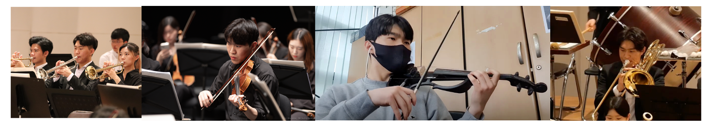

## Dongyub Han

{: width="100%"}

--------------------------------------------------

#### Seoul National University
Integrated M.S./Ph.D. Program, Department of Intelligence and Information; Music and Audio Research Group (MARG)  
March 2025 - Present

#### Seoul National University
B.S., Department of Computer Science and Engineering  
March 2018 - August 2024

--------------------------------------------------

#### Publications

##### TAP-ETS: Time-Aligned Phoneme Guiding for EMG-to-Speech Synthesis
Interspeech 2026, accepted paper  
Dongyub Han, Injune Hwang, Jaejun Lee, Jiwon Lee, and Kyogu Lee

--------------------------------------------------

#### Interest

**EMG-to-speech synthesis, speech/audio representation learning, Music Information Retrieval, symbolic music generation**

--------------------------------------------------

#### Language Skills

| Type | Strong | Experienced |
|:---:|:---:|:---:|
| **Languages** | Python, TypeScript, C | Java, C++ |
| **ML/DL** | PyTorch, Hugging Face | TensorFlow |
| **Speech/Audio** | EMG-to-speech synthesis, audio representation learning | |
| **Music AI** | Symbolic music generation, Music Information Retrieval | |
| **FrontEnd** | React, Redux, Jest | |
| **BackEnd** | | Django |
| **DevOps** | | AWS, GitHub Actions |

--------------------------------------------------

#### Experiences

##### Seoul National Univ - Music & Audio Research Group (MARG) - Graduate Researcher
2025-03 ~ Present

* Research on Music Information Retrieval, Music Generation, EMG speech synthesis, and speech/audio representation learning.
* Developed TAP-ETS with time-aligned phoneme conditioning and semantic refinement for silent EMG.

##### Seoul National Univ - Music & Audio Research Group (MARG) - Research Intern
2024-03 ~ 2024-06

* Built deep-learning prototypes for music/audio understanding and generation.

##### Google Machine Learning BootCamp
2023-09 ~ 2023-11

##### Waffle Studio
2021-09 ~ 2022-08

* FrontEnd Developer

--------------------------------------------------
