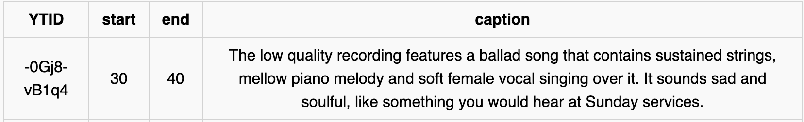
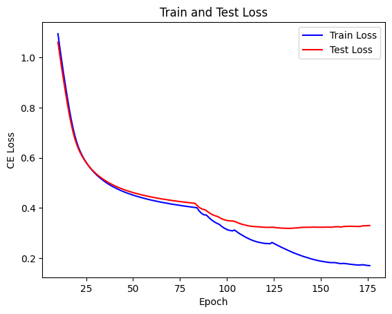

#### 프로젝트 설명

리그오브레전드 프로 게이머들의 테마곡을 만들어보고자 시도했던 과정 중에 발생한 문제를 해결하기 위한 중간 단계 프로젝트

Github : [https://github.com/ongdyub/Music-To-Text-Description-Model](https://github.com/ongdyub/Music-To-Text-Description-Model){:target="_blank"}

------------------------------------

**선수를 대표 할 수 있는 곡을 만들어 보자!**

> 어떤 것을 지표로 해야 그 선수를 대표했다고 할 수 있을까?

>> _선수가 사용하는 챔피언을 대표로 설정하자!_

**"챔피언" 이라는 고유명사를 어떻게 Music Generation에 활용하지?**

> 고유명사인 만큼 혼자만의 특성을 생각해보자

>> 이미지의 경우 스킨이 여러개 있기 때문에 보통 하나만 공식적으로 존재하는 _챔피언의 테마곡_ 을 베이스로 삼아보자!

**챔피언의 테마곡을 Music Generation에 어떻게 적용시키지?**

> Generation에 활용할 모델인 facebook/MusicGen 의 Input, Output API의 형식을 알아보자!

>> _Text Condition Gen, Audio Condition Gen, Melody Condition Gen_ 3종류가 존재한다

#### 그럼 챔피언의 테마곡을 Description으로 바꿔서 이를 활용하자!

**그런데 Description을 어떻게 만들어야하지?**

> **음악을 Input으로 넣어주면 자동으로 설명을 만들어주는 모델을 개발하자!**

------------------------------------------------------------

#### 사용한 기술

Pytorch, Huggingface, Colab

#### 프로젝트 내용

1. Dataset

    Audioset 에 있는 Music Theme의 dataset과 Music-caps Dataset을 활용

    Audioset은 ytid - start - end - description pair 약 15k개, Music-caps는 약 5.5k를 수집, 개별 raw audio는 모두 10초

    전체를 모두 학습에 활용하려 하였으나 코랩 사용의 비용 ~~가난한 학부생 ㅜㅜ~~ 문제로 Music-cpas + Audioset 조합의 6k개만 사용

    **Example Dataset**

    
    

2. Models

    Audio Encoder 후보 : AST, Wav2Vec2, Encodec, Hubert

    Text Decoder Structure 후보 : Plain Transformer, T5, LLaMa

    GPU 비용의 문제로 전체 Training이 아닌 초반 10 Epoch의 Train/Test Loss 를 확인 후 조합 결정, 또한 Pretrained 와 From Scratch 여부도 변경해 가면서 실험

    최종 조합은
    
    **Encodec(Pre-Trained) + Plain-Transformer(From-Scratch)**

    **Why?**

    > Encodec모델은 MusicGen에 실제로 사용되는 Audio 모델이기도 하다. 또한 다른 Audio Encoder와 가장 큰 차이점은, 다른 Encoder 들은 [bsz, seq_len, hidden_dim] 형식의 Output이지만 Encodec 모델은 Quantizer 를 활용한 Encoder-Decoder 구조로 Output이 Audio_codebook 이라는 Token과 같이 [bsz, # of codebook, codebook_seq] 형식으로 나온다.

    즉 Input-Output 의 형태로만 보았을 때는 _**기존의 NLP 모델의 Text to Text 모델과 동일**_ 하다는 점이다.

    

------------------------------------------------

#### Results

Music-Description Dadtaset 에 대한 평가 지표가 존재하지 않아 Loss를 기준으로 하였다.

아래의 예시들과 같이 Reasonable 한 결과들이 나옴을 알 수 있다.

#### Examples Outputs

1 Input Audio

<audio controls>
<source src="../assets/img/projects/proj-1/zeUEOxTd8IE.wav" type="audio/mpeg">
This song contains a digital drum playing a simple groove with a simple bassline.
</audio>

**This song contains a digital drum playing a simple groove with a simple bassline.**

2 Input Audio

<audio controls>
<source src="../assets/img/projects/proj-1/example2.mp3" type="audio/mpeg">
The low quality recording features a live performance of a folk song and it consists of groovy bass, shimmering hi hats, soft kick and harmonizing vocals, harmonizing vocals. It sounds energetic.
</audio>

**The low quality recording features a live performance of a folk song and it consists of groovy bass, shimmering hi hats, soft kick and harmonizing vocals, harmonizing vocals. It sounds energetic.**

3 Input Audio

<audio controls>
<source src="../assets/img/projects/proj-1/lqCx0HgF1ZM.wav" type="audio/mpeg">
This is a live performance of a folk music piece. It could be playing in the background at a coffee shop.
</audio>

**This is a live performance of a folk music piece. It could be playing in the background at a coffee shop.**

4 Input Audio

<audio controls>
<source src="../assets/img/projects/proj-1/OhZmxS5DUKU.wav" type="audio/mpeg">
This music is a contemporary instrumental. There is a a a male voice in the background.
</audio>

**This music is a contemporary instrumental. There is a a a male voice in the background.**

5 Input Audio

<audio controls>
<source src="../assets/img/projects/proj-1/4i1aizhCnfg.wav" type="audio/mpeg">
This song is a Christian gospel song.
</audio>

**This song is a Christian gospel song.**

6 Input Audio

<audio controls>
<source src="../assets/img/projects/proj-1/aDlWOvCdNMk.wav" type="audio/mpeg">
This music is instrumental. The tempo is slow with an electric guitar lead.
</audio>

**This music is instrumental. The tempo is slow with an electric guitar lead.**

7 Input Audio

<audio controls>
<source src="../assets/img/projects/proj-1/UfEGX0rNOvA.wav" type="audio/mpeg">
This is a pop music piece. It is an instrumental piece. There is an electronic drum beat in the rhythmic background. It could also be playing in the background at a dance course.
</audio>

**This is a pop music piece. It is an instrumental piece. There is an electronic drum beat in the rhythmic background. It could also be playing in the background at a dance course.**

8 Input Audio

<audio controls>
<source src="../assets/img/projects/proj-1/Ovk5EfFj7Ws.wav" type="audio/mpeg">
This song contains a digital drum playing a simple groove with a simple beat.
</audio>

**This song contains a digital drum playing a simple groove with a simple beat.**

9 Input Audio

<audio controls>
<source src="../assets/img/projects/proj-1/Mir959i7F2M.wav" type="audio/mpeg">
The song is an instrumental. The song is medium tempo with a modern pop dance tune and has poor audio quality.
</audio>

**The song is an instrumental. The song is medium tempo with a modern pop dance tune and has poor audio quality.**

10 Input Audio

<audio controls>
<source src="../assets/img/projects/proj-1/K6DSH7MSeOA.wav" type="audio/mpeg">
The tempo is slow with a Didgeridooo.
</audio>

**The tempo is slow with a Didgeridooo.**

11 Input Audio

<audio controls>
<source src="../assets/img/projects/proj-1/I4Jp0kB2Ns0.wav" type="audio/mpeg">
This song contains an acoustic guitar strumming chord progression.
</audio>

**This song contains an acoustic guitar strumming chord progression.**

12 Input Audio

<audio controls>
<source src="../assets/img/projects/proj-1/EwoCbcSXlSM-.wav" type="audio/mpeg">
The low quality recording features a live performance of a folk song and it consists of consists of a groovy bass, soft kick, shimmering hi hat. It sounds emotional and a bit a bit - like something you would hear in a bit a bit a bit noisy.
</audio>

**The low quality recording features a live performance of a folk song and it consists of consists of a groovy bass, soft kick, shimmering hi hat. It sounds emotional and a bit a bit - like something you would hear in a bit a bit a bit noisy.**

13 Input Audio

<audio controls>
<source src="../assets/img/projects/proj-1/example1.mp3" type="audio/mpeg">
This is a classical music piece. It could also be playing in the background at a coffee shop.
</audio>

**This is a classical music piece. It could also be playing in the background at a coffee shop.**

#### Train-Test Loss Graph

