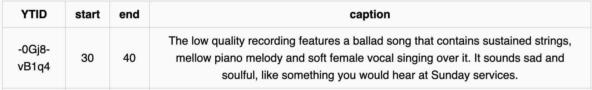
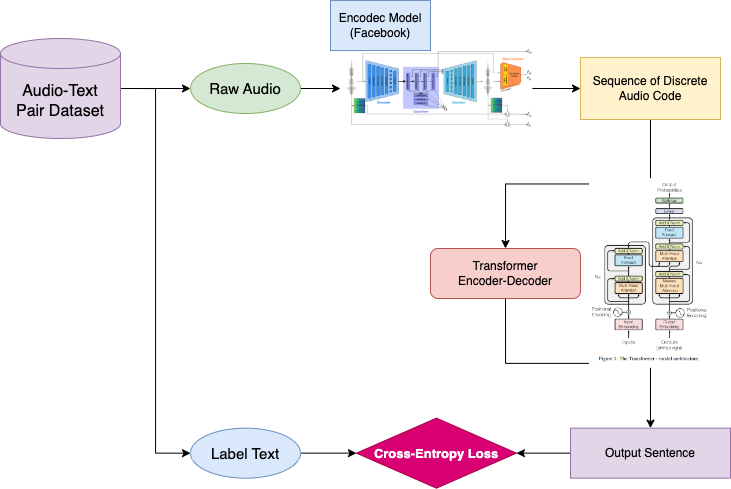
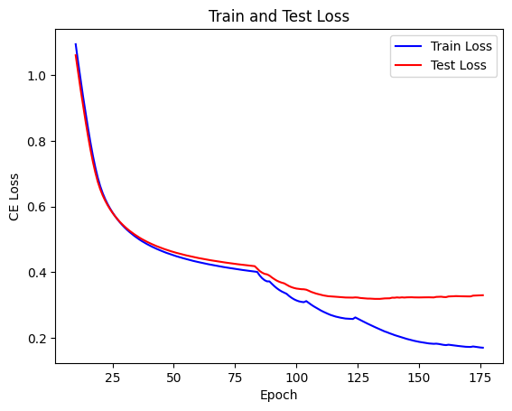

#### Project Description

Period: **Undergraduate** (Jan. 2024 - Feb. 2024)

This project was an intermediate step for solving a problem that arose while trying to generate theme songs for professional League of Legends players.

Github : [https://github.com/ongdyub/Music-To-Text-Description-Model](https://github.com/ongdyub/Music-To-Text-Description-Model){:target="_blank"}

------------------------------------

**Let's create a song that can represent a player!**

> What metric should define whether a song represents a player?

>> _Use the champions played by the player as the representative signal._

**How can the proper noun "champion" be used for Music Generation?**

> Since it is a proper noun, focus on the unique characteristics of each champion.

>> Images have multiple skins, so instead use the _champion's official theme song_, which usually exists as a single canonical source.

**How can a champion's theme song be applied to Music Generation?**

> Check the input and output API formats of facebook/MusicGen, the model used for generation.

>> There are three types: _Text Condition Gen, Audio Condition Gen, and Melody Condition Gen_.

#### Then convert the champion's theme song into a description and use it as the condition.

**But how should the description be created?**

> **Develop a model that automatically generates a description when music is provided as input.**

------------------------------------------------------------

#### Technologies Used

Pytorch, Huggingface, Colab

#### Project Details

1. Dataset

    Used the Music Theme dataset from AudioSet and the MusicCaps dataset.

    AudioSet provided about 15k ytid-start-end-description pairs, and MusicCaps provided about 5.5k samples. Each raw audio clip was 10 seconds long.

    I initially planned to use the full dataset for training, but due to Colab cost constraints ~~poor undergraduate student~~, I used only 6k samples from the MusicCaps + AudioSet combination.

    **Example Dataset**

    
    

2. Models

    Audio Encoder candidates: AST, Wav2Vec2, Encodec, Hubert

    Text Decoder Structure candidates: Plain Transformer, T5, LLaMa

    Due to GPU cost constraints, I did not run full training. Instead, I checked train/test loss during the first 10 epochs to choose the combination. I also varied whether each component was pretrained or trained from scratch.

    The final combination was
    
    **Encodec(Pre-Trained) + Plain-Transformer(From-Scratch)**

    **Why?**

    > Encodec is also the audio model actually used in MusicGen. The biggest difference from other audio encoders is that other encoders output tensors in the form [bsz, seq_len, hidden_dim], while Encodec uses a quantizer-based encoder-decoder structure and outputs audio-codebook-like tokens in the form [bsz, # of codebook, codebook_seq].

    In terms of the input-output structure, this is _**the same as a text-to-text model in conventional NLP**_.

    

------------------------------------------------

#### Results

Since no evaluation metric exists for the Music-Description dataset, I used loss as the primary criterion.

The examples below show that the model produced reasonable outputs.

#### Examples Outputs

1 Input Audio

<audio controls>
<source src="../assets/img/projects/proj-1/zeUEOxTd8IE.wav" type="audio/mpeg">
This song contains a digital drum playing a simple groove with a simple bassline.
</audio>

**This song contains a digital drum playing a simple groove with a simple bassline.**

2 Input Audio

<audio controls>
<source src="../assets/img/projects/proj-1/example2.mp3" type="audio/mpeg">
The low quality recording features a live performance of a folk song and it consists of groovy bass, shimmering hi hats, soft kick and harmonizing vocals, harmonizing vocals. It sounds energetic.
</audio>

**The low quality recording features a live performance of a folk song and it consists of groovy bass, shimmering hi hats, soft kick and harmonizing vocals, harmonizing vocals. It sounds energetic.**

3 Input Audio

<audio controls>
<source src="../assets/img/projects/proj-1/lqCx0HgF1ZM.wav" type="audio/mpeg">
This is a live performance of a folk music piece. It could be playing in the background at a coffee shop.
</audio>

**This is a live performance of a folk music piece. It could be playing in the background at a coffee shop.**

4 Input Audio

<audio controls>
<source src="../assets/img/projects/proj-1/OhZmxS5DUKU.wav" type="audio/mpeg">
This music is a contemporary instrumental. There is a a a male voice in the background.
</audio>

**This music is a contemporary instrumental. There is a a a male voice in the background.**

5 Input Audio

<audio controls>
<source src="../assets/img/projects/proj-1/4i1aizhCnfg.wav" type="audio/mpeg">
This song is a Christian gospel song.
</audio>

**This song is a Christian gospel song.**

6 Input Audio

<audio controls>
<source src="../assets/img/projects/proj-1/aDlWOvCdNMk.wav" type="audio/mpeg">
This music is instrumental. The tempo is slow with an electric guitar lead.
</audio>

**This music is instrumental. The tempo is slow with an electric guitar lead.**

7 Input Audio

<audio controls>
<source src="../assets/img/projects/proj-1/UfEGX0rNOvA.wav" type="audio/mpeg">
This is a pop music piece. It is an instrumental piece. There is an electronic drum beat in the rhythmic background. It could also be playing in the background at a dance course.
</audio>

**This is a pop music piece. It is an instrumental piece. There is an electronic drum beat in the rhythmic background. It could also be playing in the background at a dance course.**

8 Input Audio

<audio controls>
<source src="../assets/img/projects/proj-1/Ovk5EfFj7Ws.wav" type="audio/mpeg">
This song contains a digital drum playing a simple groove with a simple beat.
</audio>

**This song contains a digital drum playing a simple groove with a simple beat.**

9 Input Audio

<audio controls>
<source src="../assets/img/projects/proj-1/Mir959i7F2M.wav" type="audio/mpeg">
The song is an instrumental. The song is medium tempo with a modern pop dance tune and has poor audio quality.
</audio>

**The song is an instrumental. The song is medium tempo with a modern pop dance tune and has poor audio quality.**

10 Input Audio

<audio controls>
<source src="../assets/img/projects/proj-1/K6DSH7MSeOA.wav" type="audio/mpeg">
The tempo is slow with a Didgeridooo.
</audio>

**The tempo is slow with a Didgeridooo.**

11 Input Audio

<audio controls>
<source src="../assets/img/projects/proj-1/I4Jp0kB2Ns0.wav" type="audio/mpeg">
This song contains an acoustic guitar strumming chord progression.
</audio>

**This song contains an acoustic guitar strumming chord progression.**

12 Input Audio

<audio controls>
<source src="../assets/img/projects/proj-1/EwoCbcSXlSM-.wav" type="audio/mpeg">
The low quality recording features a live performance of a folk song and it consists of consists of a groovy bass, soft kick, shimmering hi hat. It sounds emotional and a bit a bit - like something you would hear in a bit a bit a bit noisy.
</audio>

**The low quality recording features a live performance of a folk song and it consists of consists of a groovy bass, soft kick, shimmering hi hat. It sounds emotional and a bit a bit - like something you would hear in a bit a bit a bit noisy.**

13 Input Audio

<audio controls>
<source src="../assets/img/projects/proj-1/example1.mp3" type="audio/mpeg">
This is a classical music piece. It could also be playing in the background at a coffee shop.
</audio>

**This is a classical music piece. It could also be playing in the background at a coffee shop.**

#### Train-Test Loss Graph

