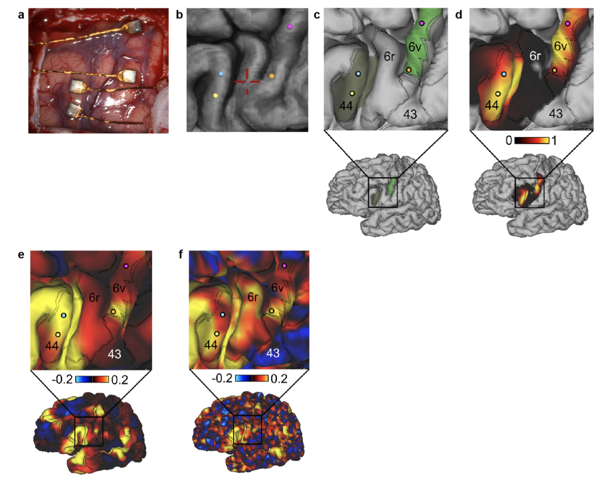
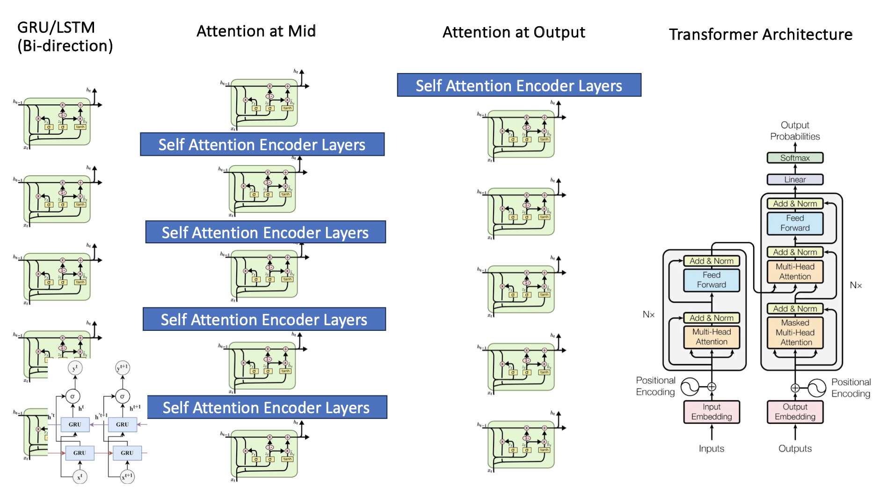
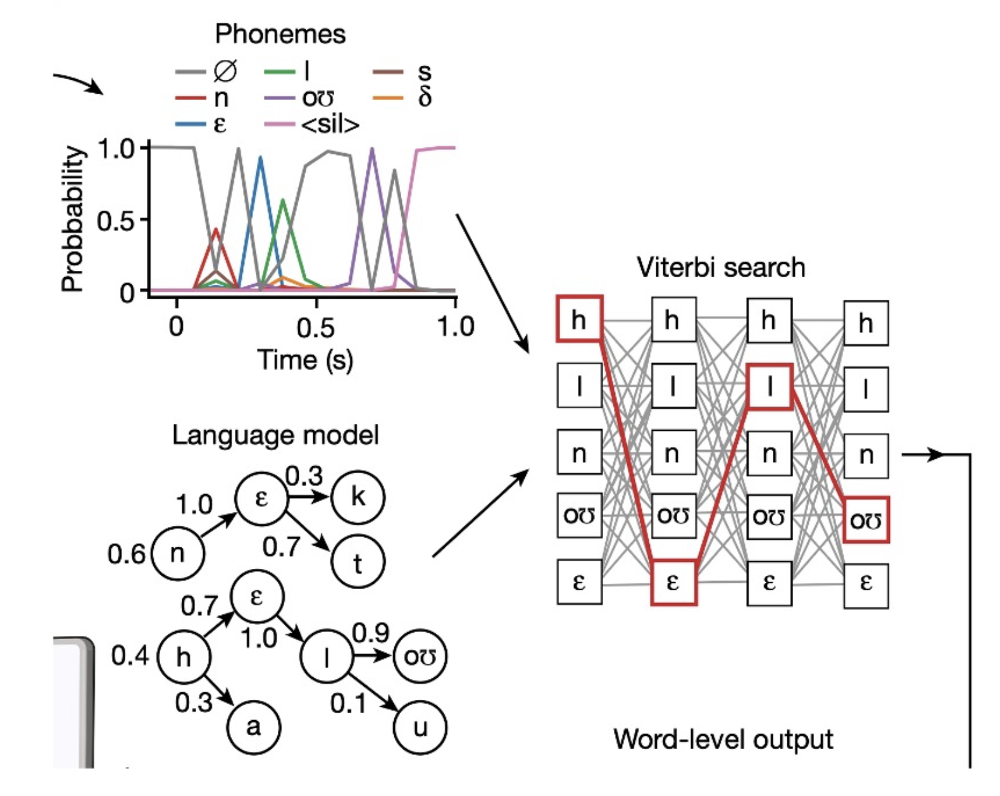
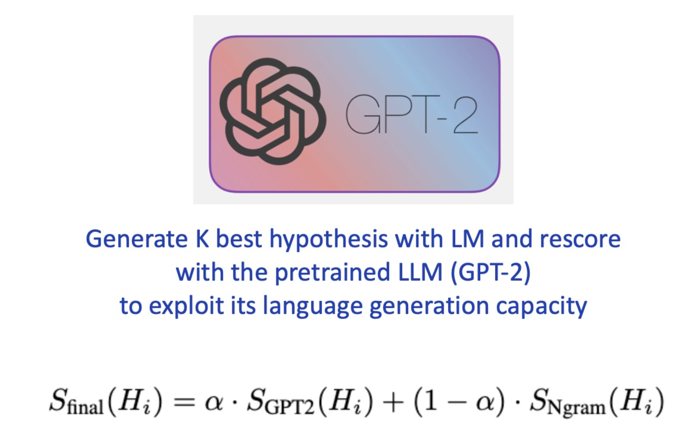
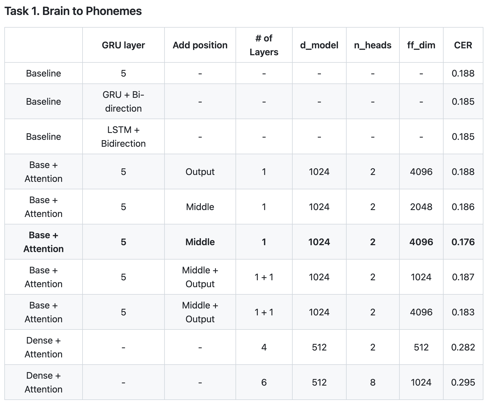
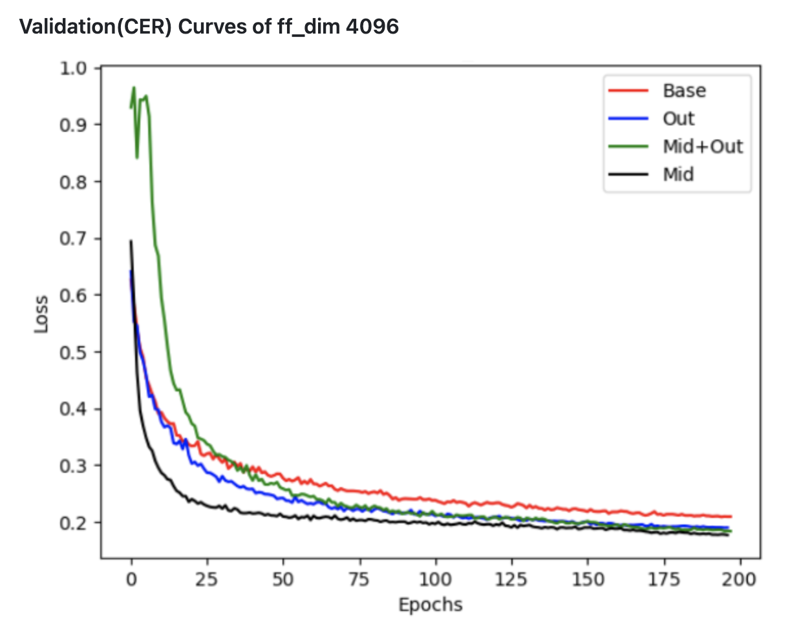
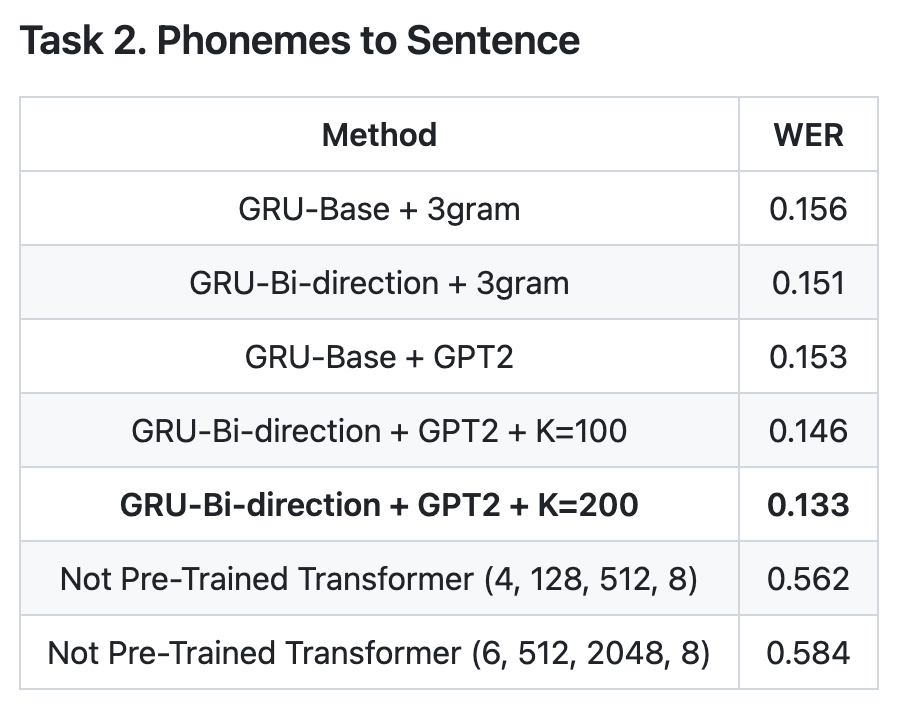
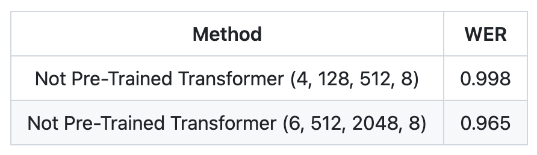

#### 프로젝트 설명

마비환자의 뇌에서 나오는 신호를 입력으로 받아, 실시간으로 환자가 어떤 문장을 말하는지를 복원하는 프로젝트이다.

Transformer 와 LLM 을 활용하여 Pre-trained 된 Model 없이 CER, WER 모두 향상시켰다.

#### 어려웠던 점

1. 발음을 할 때 사용하는 근육을 움직이는 뇌의 부분에서 발생하는 직접적인 전기 신호가 입력이라는 흔하지 않은 타입의 데이터셋

2. 뇌의 전기 신호(Spike pow)를 바로 문장으로 디코딩 하는것은 Low -> High dimention 방향의 Task

3. 위의 Task와 관련한 Pre-trained 된 LM, LLM이 없다는 어려움

#### 해결방안

**Subtask 3개로 나누어서 진행**

1. Brain to Phoneme

2. Phoneme to Sentence

3. Brain to Sentence

**기존논문의 GRU를 사용하는 방식에서 나아가 Transformer, GPT-2.5 등을 활용해 CER/WER 모두 향상시켰다.**

Paper : [A high-performance speech neuroprosthesis](https://www.nature.com/articles/s41586-023-06377-x#Sec9){:target="_blank"}

Github : [https://github.com/ongdyub/BCI](https://github.com/ongdyub/BCI){:target="_blank"}

------------------------------------------------------------

#### 사용한 기술

TensorFlow

#### 프로젝트 내용

**1. Dataset**

발음을 하려면, 구강 주변에 관련된 근육을 각 단어에 맞게 움직여야한다.

이때 해당 근육들의 움직임을 조절하는 뇌의 영역이 알려져 있어, 해당 영역에서 나오는 전기 신호를 측정기를 설치해 전극의 변화를 시간에 따라서 측정한다.

데이터의 강건성을 위해, 같은 문장에 대해 한번만 측정하는 것이 아닌 여러 날에 걸쳐서 여러번의 측정을 모두 입력 데이터로 활용하였다고 한다.

------------------------------------------------
    
**2. Task 1 - Brain To Phoneme**

입력 전기 신호를 먼저 음소의 순서로 디코딩 하는 방법이다.

기존 논문에서는 이 과정을 GRU를 사용하였데, 따라서 단순히 GRU의 hidden dim, layer 를 변경하거나 LSTM을 사용해 보기도 하는 방법과

입력 전기 신호를 Transformer Encoder 의 Embedding으로 간주 한 뒤, Decoder를 통해 음소를 디코딩하는 방법,

마지막으로는 발음할때 근육의 움직임은 이전과 이후에 모두 영향을 받을 것이라 생각해 GRU/LSTM cell 에서 Self Attention 계산을 추가하는 방식을 시도해 보았다.

Loss Function으로는 고정된 Input 길이에서 가변길이의 Target을 맞춰야 하고, STT Task과 유사하므로 CTC Loss를 사용하였다.

------------------------------------------------

**3. Task 2 - Phoneme to Sentence**

Task 1에서 학습된 모델의 Output을 활용해 최종적으로 문장으로 변환하는 방법이다.

기존 논문에서는 이 과정을 3-gram, 5-gram LM을 사용해, Task 1에서 나온 음소의 순서를 토대로 n-gram 의 확률이 가장 높은 말뭉치들의 순서를 추측해, 문장을 복원하였다. 따라서 우리는

1. Task 1의 Transformer Encoder 를 활용해 Transformer Decoder 구조로 복원하기

2. LM이 아닌 LLM 을 통한 확률 Re-scoreing 후 문장 복원

을 시도하였다.

------------------------------------------------

**3. Task 3 - Brain to Sentence**

논문에는 시도하지 않은 방식으로, Brain Spike Pow 를 바로 Sentence로 복원하는 방법이다.

Input의 Spike Pow는 시계열 데이터 이므로 Transformer 구조가 적합하다고 판단하였다.

이를 토대로 문장을 구성하는 요소를 기준으로 삼아 아래와 같이 두 종류의 Decoder를 실헙하였다.

1. Word Token Unit 단위의 Decoding (ex. I love you -> "I", "love", "you)

2. Character Unit 단위의 Decoding (ex. I love you -> I, l, o, v, e, y, o, u)

------------------------------------------------

#### Results

**Task. 1**

논문에서 제시한 방법과 비교해 CER 값은 0.188 -> 0.176 으로 향상되었다.

또한 아래의 표와 같이 여러가지의 종류의 실험을 진행해 본 결과 Attention at Middle + Baseline-GRU 조합이 가장 좋은 것을 나타냈다.

Validation Set에 대해서도 Mid가 빠르게 감소함을 볼 수 있다.

이는 뇌에서 발생하는 전기적 신호는 고차원적이므로, 단순한 GRU 구조 하나만 사용하거나, Self Attention을 조금만(Only Input or Output) 사용하기에는 정보를 충분히 담지 못하는 것 같다는 결과임을 추정하였다.

------------------------------------------------

**Task. 2**

가지고있는 컴퓨팅 자원의 문제로 5-gram 은 실험을 하지 못하였다.

하지만 3-gram을 기준으로 아래 표와 같이 GPT2 를 사용한 Re-scoreing 을 활용하면 WER이 향상됨을 볼 수 있다.

K 값은 scoring 하는 문장의 수로 참여 문장이 많아질 수록 당연히 좋은 문장을 고를 확률이 높아짐을 볼 수 있다.

------------------------------------------------

**Task. 3**

뇌 신호를 바로 문장, 또는 Charactor로 디코딩하는 것은 불가능했다.

그 이유를 생각해 봤을대 뇌의 신호는 "발음" 을 하는 근육을 움직이는 것이지 글자 그대로, 단어 그대로를 표현하는 움직임이 아니기 때문이라고 결론지었다.

------------------------------------------------

#### Conclusions

1. Self Attention & Bi-Direction Improves Decode Phoneme

    self attention 계산 방법과 bi-direction 구조 모두 뇌 신호를 음소로 복원하는데에 효과적이었다.
    
    이는 고차원적인 정보를 주고 받는 우리 뇌의 특성과 관련있다고 생각 해 볼 수 있다.

2. Feature Extraction is More Important

    attention을 사용해 CER/WER 향상이 있었지만, 높은 수준의 향상은 아니었다.

    따라서 뇌 신호 data를 증강하거나, 더 좋은 후처리 방법을 고안한다면 더 깔끔한 noise가 줄어든 dataset 을 구성해야만 한다.

3. Brain Signal is Must Decoded in Phonemes

    뇌 신호는 "발음 근육"과 관계가 있으므로 전체 단어, 문자 단위가 아닌 발음의 "음소" 단위로 복원해야 한다는 점을 볼 수 있다.
    