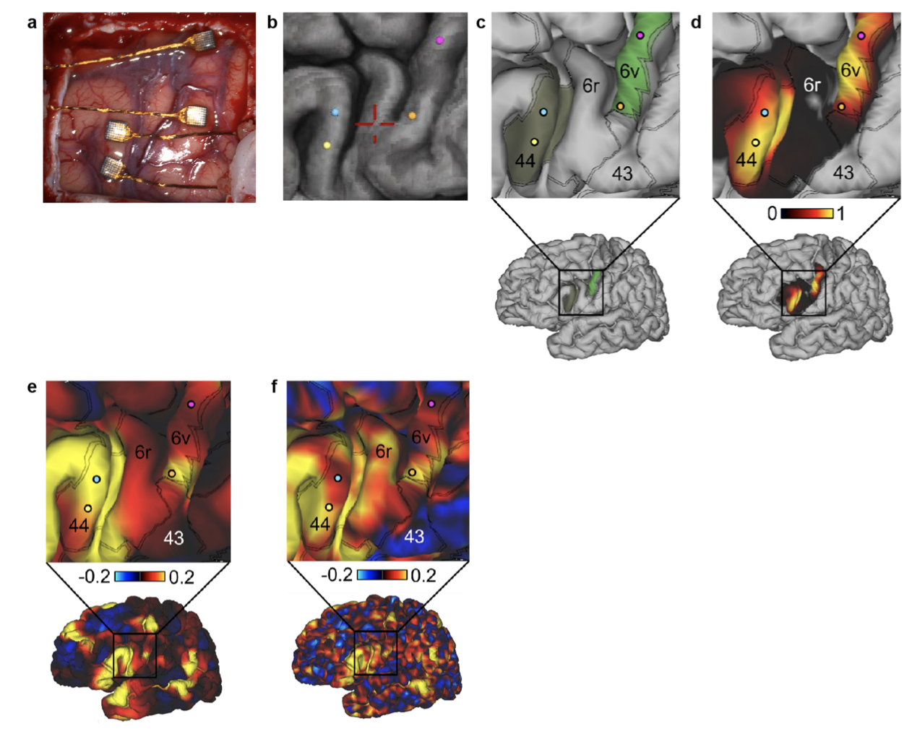
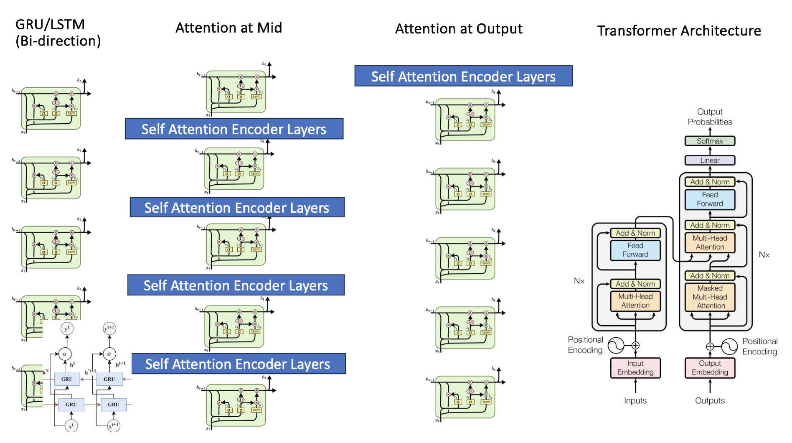
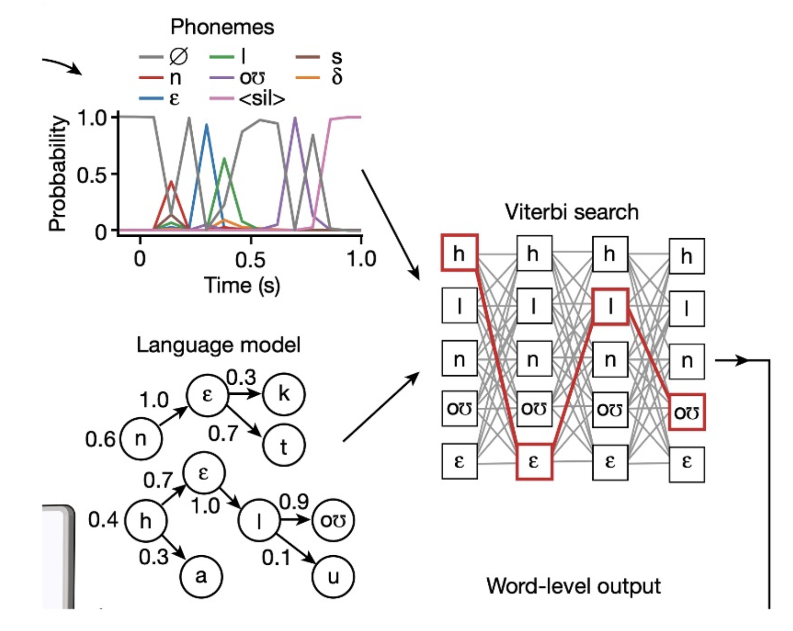
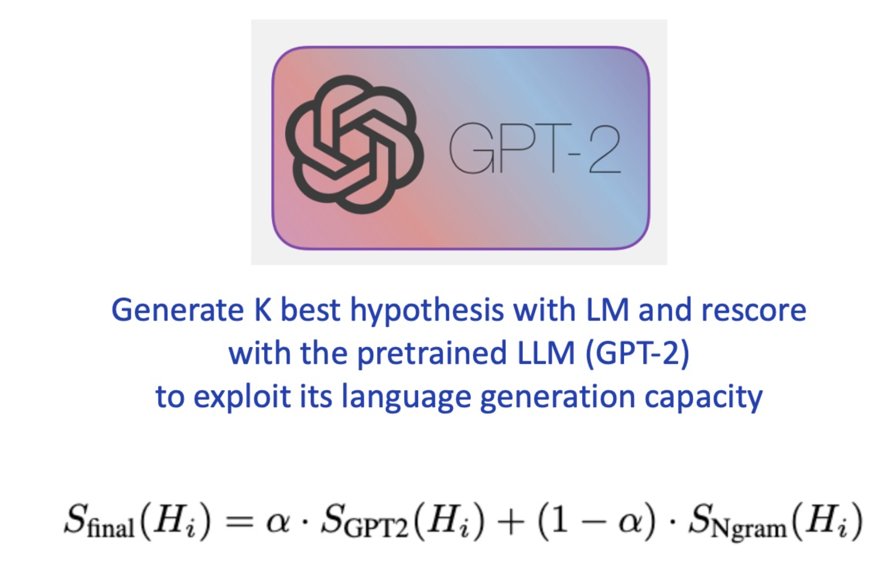
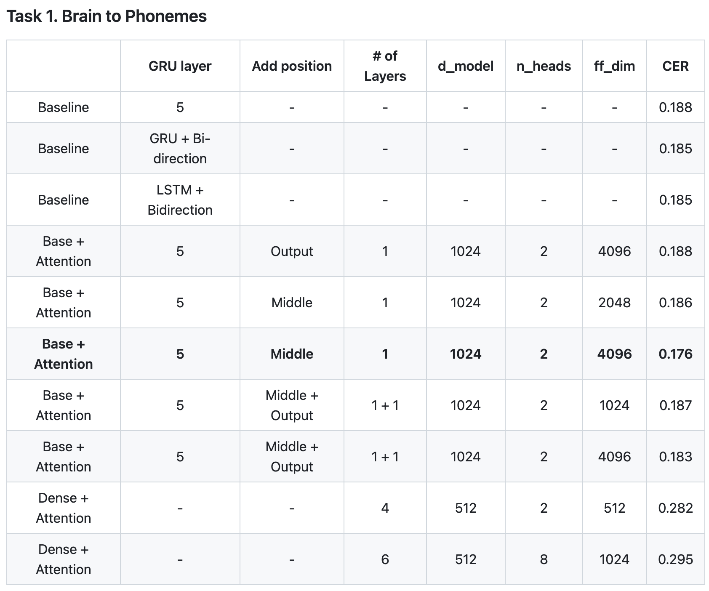
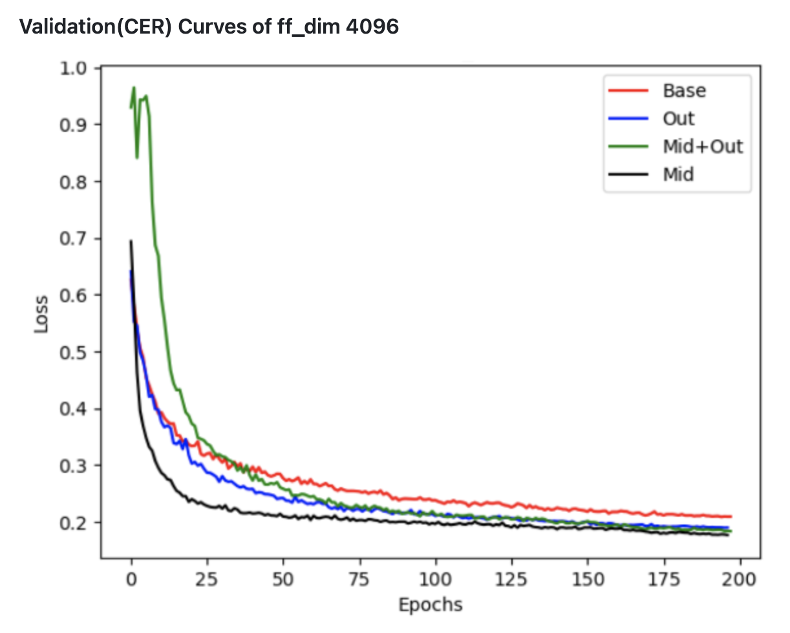
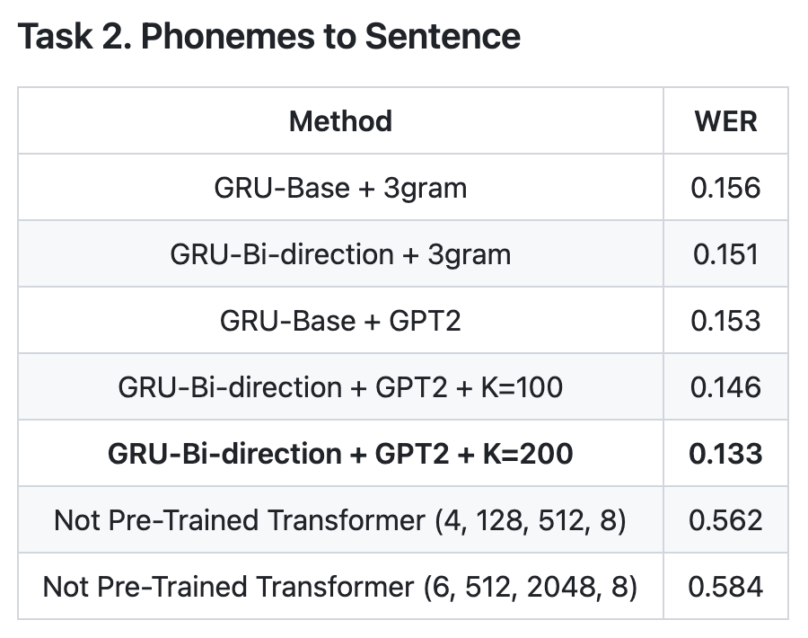

#### Project Description

Period: **Undergraduate** (Sep. 2022 - Dec. 2022)

This project restores, in real time, the sentence a paralyzed patient is trying to speak from neural signals recorded from the patient's brain.

Using Transformers and LLMs, I improved both CER and WER without relying on a pretrained model for the main task.

#### Challenges

1. The input dataset is an uncommon type of data: direct electrical signals from the brain region that controls the muscles used for articulation.

2. Decoding brain electrical signals, or spike power, directly into sentences is a low-to-high dimensional task.

3. There are no pretrained LMs or LLMs specifically aligned with this task.

#### Solution

**The work was divided into three subtasks.**

1. Brain to Phoneme

2. Phoneme to Sentence

3. Brain to Sentence

**Going beyond the GRU-based approach of the original paper, I used Transformers and GPT-2.5-style rescoring to improve both CER and WER.**

Paper : [A high-performance speech neuroprosthesis](https://www.nature.com/articles/s41586-023-06377-x#Sec9){:target="_blank"}

Github : [https://github.com/ongdyub/BCI](https://github.com/ongdyub/BCI){:target="_blank"}

------------------------------------------------------------

#### Technologies Used

TensorFlow

#### Project Details

**1. Dataset**

To pronounce words, the muscles around the mouth must move according to each word.

Because the brain regions that control these muscle movements are known, electrodes can be implanted in those regions to measure electrical signal changes over time.

For data robustness, the study did not use only a single recording per sentence. Instead, it used multiple recordings of the same sentence collected across several days as input data.

------------------------------------------------
    
**2. Task 1 - Brain To Phoneme**

This method first decodes the input electrical signals into a sequence of phonemes.

The original paper used a GRU for this process. I therefore tested approaches such as changing the GRU hidden dimension and layer count, trying LSTM variants,

treating the input electrical signals as embeddings for a Transformer Encoder and decoding phonemes through a Decoder,

and finally adding self-attention computation inside GRU/LSTM cells, based on the assumption that muscle movements during speech are influenced by both previous and future contexts.

For the loss function, I used CTC Loss because the task must align a fixed-length input with a variable-length target and is similar to an STT task.

------------------------------------------------

**3. Task 2 - Phoneme to Sentence**

This method converts the output of the model trained in Task 1 into a final sentence.

The original paper used 3-gram and 5-gram language models for this process. Based on the phoneme sequence produced by Task 1, it inferred the sentence by selecting the corpus sequence with the highest n-gram probability. Therefore, we tried the following approaches:

1. Use the Transformer Encoder from Task 1 and restore the sentence with a Transformer Decoder structure.

2. Restore the sentence after probability rescoring with an LLM rather than a conventional LM.

------------------------------------------------

**3. Task 3 - Brain to Sentence**

This method directly restores a sentence from brain spike power, which was not attempted in the paper.

Because spike power input is time-series data, I judged that a Transformer structure would be suitable.

Based on the units that make up a sentence, I tested two types of decoders as below.

1. Word-token-unit decoding (e.g., I love you -> "I", "love", "you")

2. Character-unit decoding (e.g., I love you -> I, l, o, v, e, y, o, u)

------------------------------------------------

#### Results

**Task. 1**

Compared with the method proposed in the paper, CER improved from 0.188 to 0.176.

As shown in the table below, after testing several experiment variants, the Attention at Middle + Baseline-GRU combination performed best.

The Mid variant also decreased rapidly on the validation set.

I inferred from this result that brain electrical signals are high-dimensional, so a single simple GRU structure or a small amount of self-attention, such as only at the input or output, may be insufficient to capture the information.

------------------------------------------------

**Task. 2**

Due to limited computing resources, I could not run the 5-gram experiments.

However, using the 3-gram baseline, the table below shows that WER improves when GPT-2-based rescoring is applied.

K denotes the number of candidate sentences used for scoring. As K increases, the probability of selecting a better sentence naturally increases.

------------------------------------------------

**Task. 3**

Directly decoding brain signals into sentences or characters was not successful.

I concluded that this is because brain signals correspond to the movement of muscles used for articulation, not to letters or words themselves.

------------------------------------------------

#### Conclusions

1. Self Attention & Bi-Direction Improves Decode Phoneme

    Both self-attention computation and the bidirectional structure were effective for restoring phonemes from brain signals.
    
    This can be interpreted in relation to the high-dimensional information exchange characteristics of the human brain.

2. Feature Extraction is More Important

    Although attention improved CER/WER, the improvement was not large.

    Therefore, stronger performance would likely require augmenting brain-signal data, designing better post-processing methods, or constructing a cleaner dataset with less noise.

3. Brain Signal Must Be Decoded in Phonemes

    Because brain signals are related to the "articulation muscles," they should be restored at the phoneme level rather than directly at the word or character level.
