#### Project Description

Period: **Undergraduate**

This project summarizes the content of five recommended articles for a single stock item into one summary without losing semantic information.

It was a semester-long project proposed by DeepTrade, a stock information company. The result was strong enough that it did not remain only a project deliverable, but was integrated into the actual Xpercent app as a feature.

Github : [https://github.com/ongdyub/Multi-Document-Summarization](https://github.com/ongdyub/Multi-Document-Summarization){:target="_blank"}

<a href="https://drive.google.com/file/d/1QF71094PzUU7Kom9QiA3HjwsYBmBehVG/view?usp=sharing" target="_blank"> Full Final Report </a>

------------------------------------------------------------

#### Challenges

0. Personal proficiency in NLP and deep learning

    Since this was my first deep learning project and team project, I was most concerned about my personal proficiency. I only had a basic understanding of code implementation and core concepts, so I was also concerned about whether I could catch up quickly enough.

1. Lack of dataset

    The company only provided links to Naver News articles, and neither HTML preprocessing results nor ground-truth summaries were provided. It was difficult to define the criteria for what should be considered a good summary and treated as a ground-truth label.

2. Defining what makes a good summary

    The quality of a summary cannot be absolutely quantified and varies by person. In addition, our task focused on stock-item-related content, so the requirements for summaries in this domain may differ from general summarization. Designing an appropriate evaluation method for this was difficult.

3. Designing a method to connect and summarize five articles

    A single article may contain as few as five sentences or as many as ten paragraphs. Simply concatenating five articles and generating a sentence from them would make the input too long, and the articles may contain different information. The challenge was to find a method that could produce a coherent combined summary.

------------------------------------------------------------

#### Solution

0. Personal proficiency in NLP and deep learning

    We defined subtasks for each pipeline stage and discussed methods for solving each problem with teammates every two weeks.
    
    Week 1: (1. Problem definition 2. Discussion of possible solutions 3. Study of solutions and assignment of experiments)
    
    Week 2: (1. Experiment results for each proposed solution 2. Discussion and Q&A on each result 3. Final method selection)
    
    Through this process, I studied the methods I implemented in depth, and I was also able to understand methods I did not implement through discussion and Q&A.

1. Dataset

    We used the source-summary dataset for the "economy" theme released on AI-Hub, and we generated summaries with the GPT-3.5 API for articles currently stored in the Xpert app DB, treating them as ground-truth labels. As a result, we used 10,000 GPT-generated summaries and 24,100 AI-Hub samples as the dataset.

    **Q. If GPT-generated summaries are used as labels, doesn't this simply train a model to imitate GPT? Then why not just use GPT instead of designing a new model?**

    > This is a reasonable concern. Without additional processing, it would be correct. However, we proposed a new method called "keyword matching loss" to generate summaries better suited to the financial domain, which differentiates our approach from simply using GPT.

    > Also, if GPT were used directly to generate summaries for every article in the app, the cost would be around KRW 100,000 to 200,000 per day, which would create a budget issue for continuous operation.

2. Criteria for good summaries

    We used ROUGE-SU, which is known to be suitable for Korean summarization evaluation and measures simultaneously occurring word-pair relationships. Since this was a financial-domain task, we also extracted "article keywords" such as _bankruptcy_, _investment_, and _listing_, and **proposed our own evaluation criteria** based on how many such keywords were included and whether the extracted keywords were appropriate.

3. Generating one summary from five articles

    We solved this with a three-stage summarization process. First, generate an individual summary for each article using the keywords proposed in step 2. Second, group the five generated summaries using keywords to decide which summaries should be re-summarized together. Finally, concatenate the summaries in the same group and summarize them again with the model.

------------------------------------------------------------

#### Technologies Used

Pytorch, HuggingFace

------------------------------------------------------------

#### Project Details

**1. Architecture Diagram**

Because the system had to be implemented inside an app, I first designed the operating structure as shown below.

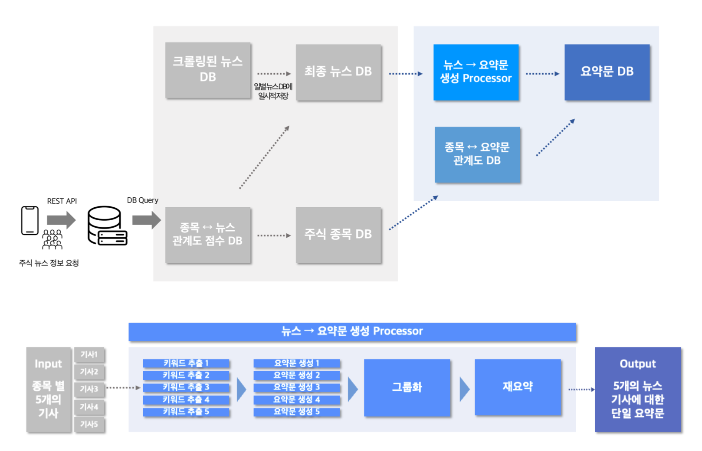

The detailed pipeline for the main task, news-to-summary generation, is as follows.

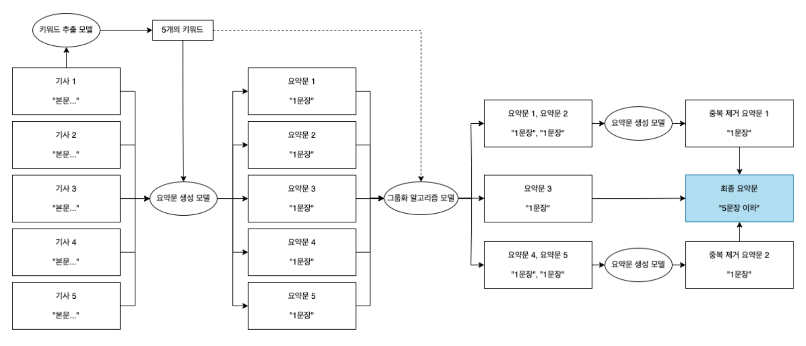

1. Extract keywords from each of the five articles.
2. Generate summaries using the extracted keywords.
3. Group the summaries through a grouping algorithm.
4. Re-summarize the grouped summaries.
5. Generate the final summary.

--------------------------------------------------------

**2. Keyword Extraction**

Since summarization is a task without a single ground-truth answer, this project first used an extractive-summary approach to extract important article content in keyword form, and then trained and evaluated the model so that generated summaries would include those keywords.

Therefore, keyword extraction was the stage for creating data used to train and evaluate the summary generation model. I also considered extracting important information at the sentence level, but important content is generally distributed throughout an article. Therefore, keyword-level extraction was judged to be more suitable for this project than sentence-level extraction.

We ran four experiments in total, and the part I handled was the KeyBERT-MSS experiment.

For methods I did not implement, I briefly describe only the method and results.

1. KeyBERT - MSS

    This method first selects K keyword candidates using cosine similarity. Then, from those K keywords, it extracts T keywords by choosing the T pairs that are farthest apart among the candidate keywords to encourage diversity.

    The suitability of keyword extraction was evaluated by averaging, across the dataset, how many extracted keywords appeared in the ground-truth summary.

    The detailed experiment procedure was as follows.

    > 1. Prepare two morpheme extraction models: one with a user-defined dictionary and one default extraction model.
    > 2. Extract 10 candidate words with each morpheme extraction model.
    > 3. Extract each candidate using 5-gram, 8-gram, and 10-gram settings.
    > 4. Apply MSS to each extracted n-gram set and extract the final five keywords.
    > 5. Calculate the ratio using the dataset.

    The experiment results are shown below.

    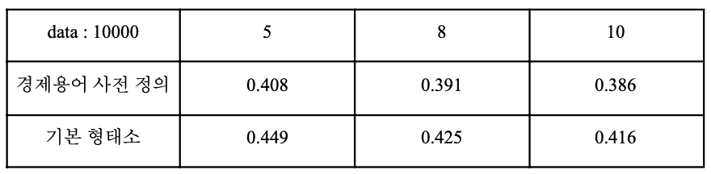

    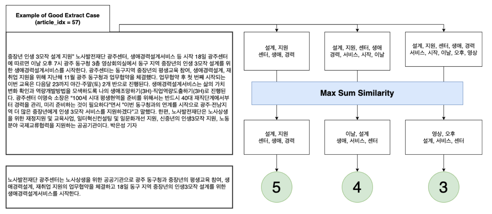

    The experiment showed that KeyBERT-MSS keyword extraction accuracy was low, at around 40%.

    Since the value decreased as the n-gram size increased, MSS appears useful for diversifying keywords, but in the constrained domain of finance and stock-related articles, this semantic diversification actually reduced keyword extraction performance.

    This is also supported by the fact that experiments using a predefined financial-term dictionary performed better than the default morpheme analysis.

2. KeyBERT - MMR

    After selecting the most important keyword, this method selects words that are not similar to already selected keywords but are similar to the document. I analyzed the extracted keywords according to the Diversity hyperparameter, which controls the similarity ratio.

    The results are shown below.

    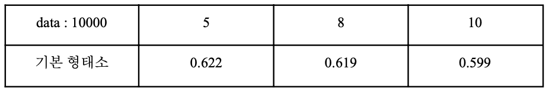

3. TF-IDF

    This is a classical rule-based algorithm.

    It quantifies TF and IDF to build a DTM, or Document-Term Matrix, and assigns an importance weight to each word in the matrix.

    Word frequency and document frequency are important factors in the algorithm. Its advantage is that even if a word appears frequently, it is classified as less important when it appears frequently across documents. Its disadvantage is that it does not consider word meaning and cannot handle homonyms.

    The results are shown below.

    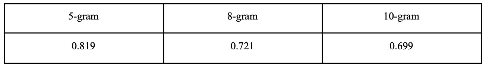

4. TextRank

    This is a classical graph-based rule-based algorithm.

    It can capture text structure, considers similarity and relevance between words, and works regardless of document length.

    However, words that appear frequently within a document are more likely to be extracted as keywords, and since keywords are extracted within a single document, relationships with other documents are not considered.

5. Final Implementation

    For keyword extraction, we finally selected the preprocessed TextRank algorithm, which achieved the highest performance of 84.5% on the keyword-extraction performance verification dataset generated using open-source data.

    The final preprocessing methods were **stopword improvement**, **normalization (removing special characters, English letters, and numbers)**, and **morpheme analysis (word specification)**.
    
    The final results are shown below.

    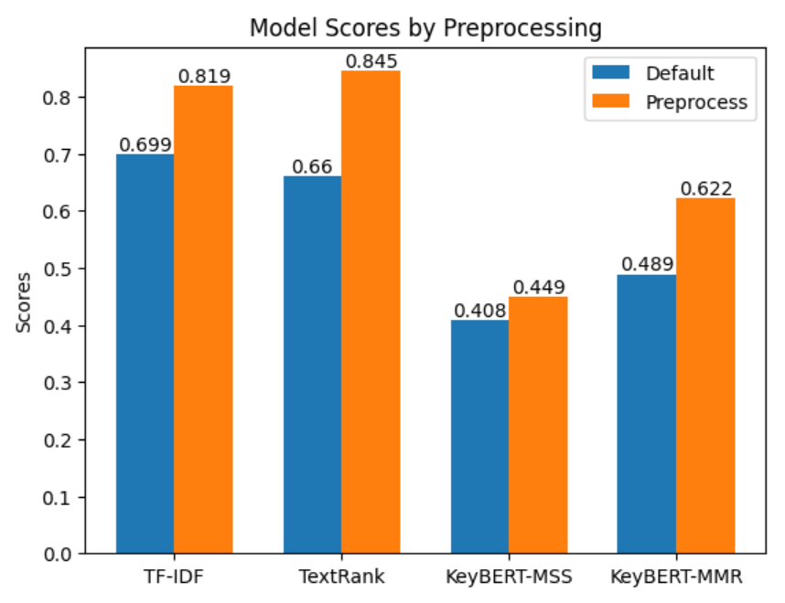

--------------------------------------------------------

**3. Individual Summary Generation**

The key content extracted from articles in the previous stage is a set of words, which is not user-friendly to present directly. It includes important content from the article, but it does not contain all important information from the article.

Therefore, to present this information to users, a summary generation model is needed to generate natural language sentences that include the important article content extracted as keywords.

We first selected the evaluation metrics for summary performance, then selected a Korean LLM model, defined a baseline model, and fine-tuned it with the keyword-inclusion loss proposed in step 2.

My part was proposing a new loss using keywords and incorporating it into fine-tuning.

1. Selecting evaluation metrics and the baseline LLM model

    Since the input consists of Naver News articles, we first searched for models pretrained in Korean as baseline LLM candidates.

    We evaluated open-source LLM performance using the ROUGE-SU score. Since summary generation is a generation task, we selected two BART-based models: KoBART-base-v2 and KoBART-Summarization.

    The former is only pretrained, while the latter is fine-tuned on open-source news article-summary pairs collected across domains.

    The evaluation results are shown below, and KoBART-Summarization was selected as the baseline.

    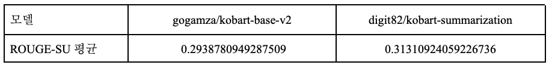

2. Model Fine-Tuning with Keywords

    The "keyword matching loss function" checks how many extracted keywords containing the article's key content are included in the summary. It outputs 0 if all keywords are included and the maximum value if none are included.

    By using this function together with the cross-entropy function between the model's predicted summary and the GPT-generated summary, and by tuning the training ratio between the two, we trained the model to learn high-quality summary generation.

    In addition, we extracted economic and stock-related article data from an open-source dataset that contains human-written ground-truth summaries and used it for training to further improve summary generation quality.

    However, the keyword matching loss function is necessarily non-differentiable with respect to the model parameters because it counts occurrences using an internal _'in' operation_ and uses _if statements_.

    Therefore, I considered that the keyword matching loss would not directly contribute to the direction of parameter updates through differentiation and backpropagation, but instead would indirectly contribute to training as a bias term.

    <strong>In other words, I interpreted it as shifting the embedding space of generated sentences toward the keyword words.</strong>

    When the keyword matching loss function is combined with the cross-entropy function used for supervised fine-tuning of KoBART, it indirectly helps the model find parameter states that generate summaries containing more keywords. It does so by sharply increasing the loss when the model is in a parameter state that generates summaries with only a small number of included keywords.

    The three tested forms of the keyword matching loss function are shown below. T denotes the threshold value for the number of keywords.

    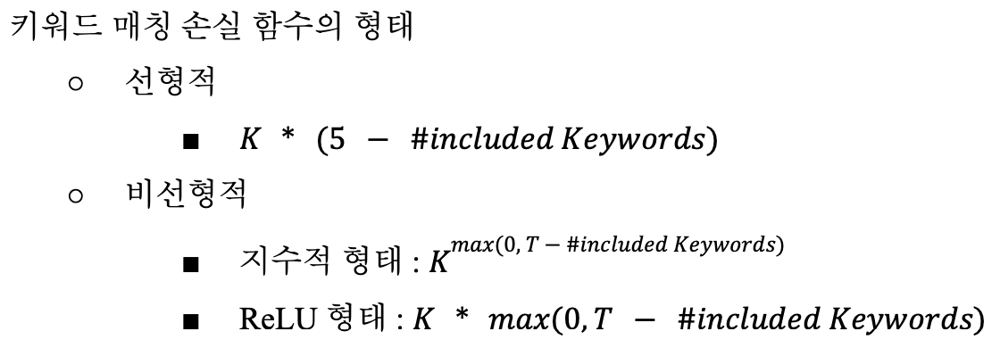

    Performance for the keyword functions was evaluated using ROUGE-1, ROUGE-2, and keyword inclusion ratio. The comparison table is shown below.

    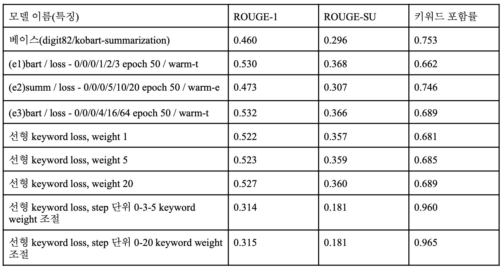

    For each method, only the model with the highest performance after hyperparameter tuning is shown.

3. Final Implementation

    The final model and the performances of the open-source summary fine-tuning model and other strong implemented models are shown in the following graph.

    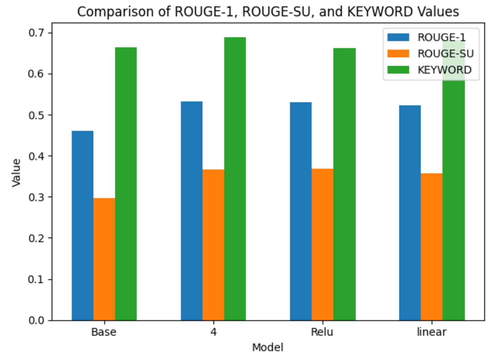

    All fine-tuned models using keywords achieved higher ROUGE scores and keyword inclusion ratios than the KoBART baseline.

    Therefore, adding keywords was shown to improve performance. Detailed summary generation examples can be found in section 3.3.5 of the full report.

--------------------------------------------------------

**4. Removing Redundant Information Between Summaries and Grouping**

The summaries generated through the previous stages are individual article summaries.

If these are displayed in the Xpercent app, five sentences would appear on the direct-article page and five sentences on the indirect-article page, producing too much text on screen.

In addition, if two article summaries like the following are displayed on the page, redundant information is repeatedly provided to the user.

> Summary 1: Samsung Electronics released the new Galaxy Note 7 smartphone.
> Summary 2: Explosion incidents are continuing with Samsung Electronics' newly released Galaxy Note 7 smartphone.

Displaying a large amount of text on screen and providing redundant information are undesirable and must be improved.

Therefore, we tried three grouping methods: SBERT-STS Embedding, SBERT-NLI Embedding, and summary keywords.

The method I worked on was the SBERT-STS Embedding method.

1. SBERT-STS Embedding

    I tested whether related articles could be classified using sentence embedding vectors for articles generated by SBERT-STS, a model fine-tuned on sentence similarity classification tasks.

    Text vector embeddings were applied separately to article bodies and article summaries.

    I also considered that company names appearing in the article body or summary might cause unrelated articles to be judged as related after vector embedding. To test this, I replaced company names with "company name" or removed them entirely, then examined how the embedding vectors and classification performance changed.

    The results are shown below.

    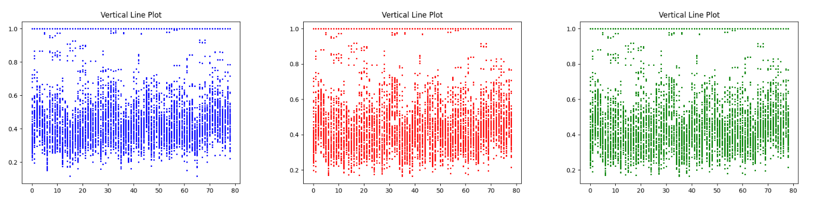

    This figure shows the distribution of cosine similarities between each article and other articles. A threshold of about 0.8 appeared to separate article similarity clearly.

    However, after manually checking articles with high similarity, I found that documents could exceed a cosine similarity of 0.8 when they had high structural similarity rather than semantic similarity.

    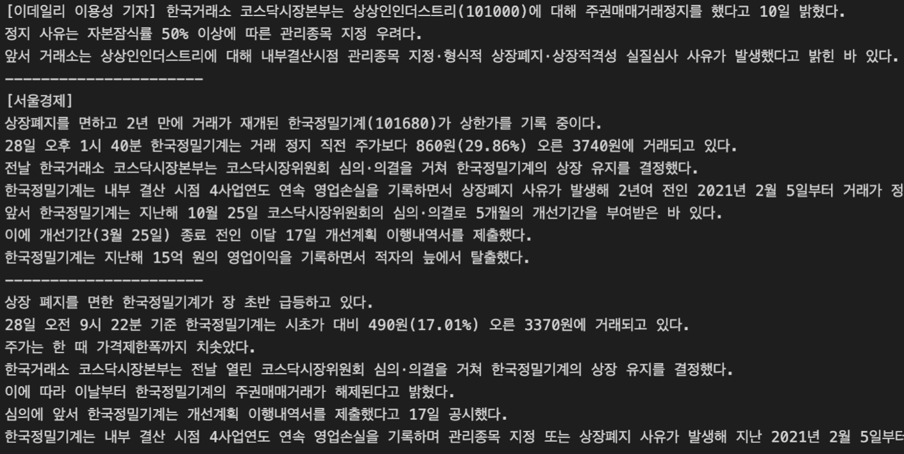

    The above example is one group whose pairwise cosine similarities are all above 0.8.
    
    Although the article formats are very similar, the contents are unrelated: trading suspension, turnaround from deficit, and early rapid rise.

    However, when I applied the SBERT-STS model to article summaries from the current app dataset, which consists of 527 stock items and 2,000 articles with high importance scores shown in the app, I found that 310 pairs of articles were grouped.

    After manually verifying the 310 article pairs, I confirmed that most grouped articles were grouped properly.

2. SBERT-NLI Embedding

    As in the redundancy example presented in the task definition, I judged that related articles with redundant information would logically have entailment relationships.

    Therefore, I applied an SBERT-NLI model trained on a logical entailment classification task to pairs of generated summaries, expecting that it could determine whether two articles were related.

3. Keyword-Based Grouping

    This method judges relatedness based on how many keywords used for summary generation overlap.

4. Final Implementation

    We selected the grouping method using SBERT-STS Embedding. STS and NLI had similar grouping quality, but STS uses cosine embedding and requires nCr computations, while NLI requires nPr computations. Therefore, STS was selected.

    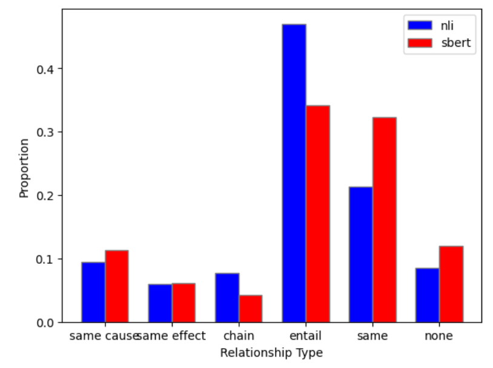

--------------------------------------------------------

**5. Conclusion**

In this project, we developed a news article summarization service to be added to DeepTrade's stock-item information application, Xpercent.

To solve summarization as a generation task without a single ground-truth answer, this project combined rule-based extractive summarization through keyword extraction with deep-learning-based abstractive summarization using a BART model.

For keyword extraction, we tested four methods: TF-IDF, TextRank, KeyBERT-MMS, and KeyBERT-MMR. TextRank was selected as the final method.

For article summarization with a BART model, we directly fine-tuned KoBART, a Korean-pretrained model, and implemented a high-performing summary generation model.

We designed and used a custom "keyword matching loss function" that extracts keywords from article bodies and trains the model so that extracted keywords are included in the summary. We also augmented article-summary pair training data using OpenAI's GPT API.

Model fine-tuning was performed across many settings by changing the keyword matching loss function form, training method, warmup method, loss weight, learning rate, and batch size. As a result, **we successfully built a model that outperformed the open-source Korean summarization model "digit82/kobart-summarization" by 0.072 in ROUGE-1 and 0.070 in ROUGE-SU, while also achieving a higher keyword inclusion ratio.**

We also conducted experiments and research on grouping related articles within a single stock item.

We tested cosine-similarity-based grouping using SBERT-STS, grouping through an entailment-classification model based on SBERT-NLI, and keyword-overlap-based grouping. Through these experiments, we implemented an SBERT-STS-based grouping method with 85% accuracy and implemented a method for generating integrated summaries across multiple related articles.

The processes for stock-item article summary generation, namely "keyword extraction," "individual summary generation," and "grouping and final summary generation," were modularized as separate functions for ease of use. Comments and code documentation were also delivered to the company to support usability.

