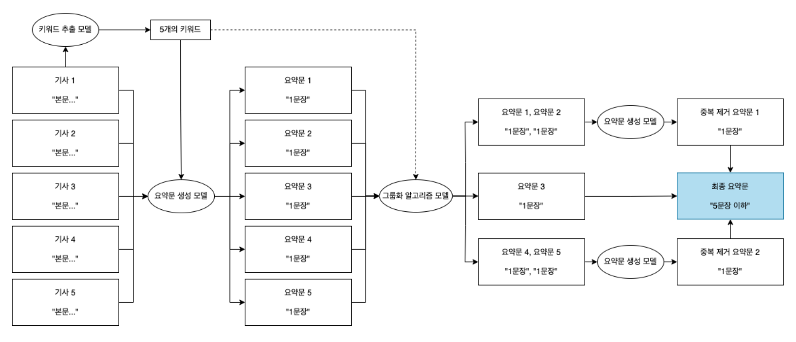

#### 프로젝트 설명

주식 종목 1개에 대한 5개의 추천 기사 내용을 의미의 손실 없이 하나로 요약하는 프로젝트이다.

주식 정보 업체 딥트레이드 에서 제안한 1학기 동안 진행했던 프로젝트이며, 결과가 매우 잘 나와 프로젝트성 작업에 그치지 않고 실제로 앱(Xpercent) 내의 기능으로 탑재되었다.

Github : [https://github.com/ongdyub/Multi-Document-Summarization](https://github.com/ongdyub/Multi-Document-Summarization){:target="_blank"}

<a href="https://drive.google.com/file/d/1QF71094PzUU7Kom9QiA3HjwsYBmBehVG/view?usp=sharing" target="_blank"> 최종 보고서 전문 </a>

------------------------------------------------------------

#### 어려웠던 점

0. NLP 및 딥러닝에 대한 개인적인 숙련도

    처음으로 진행하는 딥러닝 프로젝트 + 팀 프로젝트 이다 보니 개인적인 숙련도 문제가 가장 걱정되었다. 기본적인 코드 구현 및 개념만 알고 있는 상태여서 빠른 속도로 따라 갈 수 있을지에 대한 걱정도 함께였다.

1. Dataset의 부재

    회사측에서 데이터를 네이버 뉴스의 링크만 제공을 하여 html 전처리 및 정답 요약문은 제공되지 않았다. 어떤 글을 좋운 요약문이라 생각해 정답 label로 간주 할 지 기준을 정하는것이 어려웠다.

2. 좋은 요약문이라는 기준의 선정

    좋은 요약문 이라는 것에 대한 기준은 절대적인 수치화 할 수 있는 것이 아니라, 사람 개인에 따라 편차가 존재한다. 또한 우리가 진행하려는 작업은 "주식 종목 관련 내용"에 초점이 맞춰져 있으므로, 해당 도메인에 대한 요약문에 대한 요구사항은 일반적인 요약문과는 다를 수 있다. 이에 대해 적절한 평가 방식을 도입하는 것이 어려웠다.

3. 5개의 기사를 어떻게 연결해 요약할 것인지에 대한 방법 고민

    하나의 기사도 짧게는 5문장, 길게는 10문단으로 구성되어있다. 즉 단순히 5개으 기사를 이어 붙여서 문장을 생성하기에는 입력의 길이가 너무 길어지고, 서로 포함하고 있는 내용이 다른 경우도 있어서 적절하지 않다. 이를 어떻게 해결해야 적절하게 어우러진 연결된 요약문이 나올지 방법을 생각하는 것에 대한 어려운점이 있었다.

------------------------------------------------------------

#### 해결 방안

0. NLP 및 딥러닝에 대한 개인적인 숙련도

    Pipeline 단계에 맞춰 Subtask를 목표로 설정한 후 해당 문제를 해결하기 위한 여러가지 방법을 팀원들끼리 격주로 주제를 정해서 토의하였다.
    
    즉 첫주 - (1. 문제 설정 2. 해결 방안에 대한 토론 3. 해결 방안 공부 및 실험자 분배)
    
    두번째주 - (1. 각 해결방안에 대한 실험 결과 2. 각 결과에 대한 토론 및 질의 응답 3. 최종 Method 결정)
    
    의 과정을 거쳐 내가 잰행한 방법에 대해서는 공부를 자세하게 하게 되고, 진행하지 않은 개념이라도, 질의응답과 토론을 통해 알 수 있었다.

1. Dataset

    AI-Hub에 공개되어있는 "경제" 테마의 원문-요약문 Dataset과 Xpert 앱 DB에 현재 저장되어있는 기사들을 GPT 3.5 API를 사용해 요약문을 생성해 이를 정답 label로 간주하였다. 따라서 GPT를 사용핸 10,000개의 요약문고 AI-Hub 의 24100 개를 dataset으로 활용하는것으로 해결하였다.

    **Q. GPT로 만든 요약문을 label로 사용하면 결국 GPT와 같은 모델을 만드는 것이 아닌가? 그럼 그냥 GPT를쓰지 왜 굳이 모델을 새로 설계하나요?**

    > 충분히 나올 수 있는 문제 제기라고 생각한다. 만약 추가적인 프로세싱이 없다면 맞는 말이다. 하지만 우리는 "키워드 매칭 손실" 이라는 새로운 방법을 제시해 경제 도메인에 조금더 적합한 요약문을 생성하고자 한 점이 GPT와는 다른 점이다.

    > 또한 GPT를 그냥 사용할 경우 앱 내의 존재하는 모든 기사에 대한 요약문을 생성하였을때, 비용이 하루에 10-20만원 가량으로 지속적으로 사용하기에는 예산 문제가 발생할 수 밖에 없다.

2. 좋은 요약문의 기준 선정

    한국어 요약문 평가에 적합한 것으로 알려진, 동시에 출현하는 word pair 쌍을 기준으로 측정하는 ROUGE-SU,  score를 사용함과 동시에, 경제 관련 도메인인 만큼 "기사의 키워드" _예를 들어 '파산', '투자', '상장'_ 과 같은 단어를 추출하여 해당 키워드가 얼마나 포함되었는지, 또 뽑힌 키워드는 적절한지에 대한 기준을 **자체적으로 제안**하여 평가 지표로 삼았다.

3. 5개의 기사를 연결해 하나의 요약문을 생성하기

    3단계를 걸쳐서 요약을 하는 것으로 문제를 해결하였다. 첫번째 단계는 우선 2번에서 제시된 키워드를 활용해 개별 기사에 대한 요약문을 생성하는 것이다. 두번째는 생성된 5개의 요약문에 대해 키워드를 활용해서 재요약 할 요약문을 그룹화 하는 것이다. 마지막으로는 같은 그룹으로 묶인 요약문들에 대해서는 요약문들을 이어 붙인 뒤, 다시 모델을 활용해 요약하는 방식으로 해결하였다.

------------------------------------------------------------

#### 사용한 기술

Pytorch, HuggingFace

------------------------------------------------------------

#### 프로젝트 상세 내용

**1. Architecture Diagram**

앱에서 구현이 되어야 하기 때문에 먼저 작동 구조에 대한 Diagram을 아래의 그림과 같이 설계하였다.

Main Task인 뉴스 -> 요약문 생성 Process에 관한 구체적인 Pipeline 은 아래와 같다.

1. 5개의 기사에 대해서 키워드를 각각 추출하고
2. 키워드를 활용해 요약문을 생성한뒤
3. 그룹화 알고리즘을 통해 요약문을 그룹화 하고
4. 그룹화 된 요약문을 대상으로 재요약을 진행한 뒤
5. 최종 요약문을 생성한다.

--------------------------------------------------------

**2. 키워드 추출**

요약문 생성은 정답이 없는 과제이기 때문에, 본 프로젝트에서는 우선 Extractive Summary 방식으로 기사의 중요 내용을 키워드 형태로 추출하고, 생성될 요약문이 이 키워드들을 포함하고 있도록 만들어 모델 학습과 평가를 가능하게 하였다.

따라서 키워드 추출은 요약문 생성 모델을 학습 및 평가하기 위한 데이터를 만드는 단계이다. 기사 내 중요 정보를 문장 단위로 뽑는 방법도 고려하였으나, 일반적으로 한 기사 내에서도 중요한 내용이 분산되어있으므로 문장 단위보다 키워드 단위의 정보 추출이 본 프로젝트와 더욱 적합하다고 판단하였다.

총 4가지의 실험을 진행하였으며, 내가 진행한 부분은 KeyBERT - MSS 실험이다.

진행하지 않은 방법에 대해서는 설명과 결과만 간단하게 언급하겠다.

1. KeyBERT - MSS

    위 방법은 K 개의 키워드 candidate를 먼저 cos similarity로 선정한다. 이후 K개의 키워드 중 T 개의 키워드를 추출하는데, 이때 T개의 다양성을 위해 K개의 참여 키워드 중 거리가 가장 먼 T쌍을 선택하는 방식이다.

    키워드 추출 방법 평가의 적합성은 뽑은 키워드들이 정답 요약문에 몇개가 들어있는지를 Dataset 전체에 대해 평균을 낸 값을 사용하였다.

    구체적인 실험 방법은 아래와 같다.

    > 1. 사용자 사전 정의가 된 형채소 추출 모델/기본 추출 모델 2가지를 준비
    > 2. 각 형태소 추출 모델로 candidate 할 단어 10개 추출
    > 3. 각 candidate를 5-gram, 8-gram, 10-gram 으로 추출
    > 4. 추출한 각 n-gram 에서 MSS를 적용해 최종 5개의 키워드를 추출
    > 5. Dataset을 활용해 비율을 계산한다.

    실험 결과는 아래와 같다.

    

    

    실험 결과 KeyBERT MSS 의 키워드 추출 정확도는 40% 정도로 낮은 수준의 정확도를 가지는 것을 확인였다.

    gram의 수가 늘어날 수록 값이 감소하는 것으로 보아 MSS는 키워드를 다양화 하기에는 적합하지만 경제 / 주식 종목 관련 기사라는 한정된 주제에서 추출하기에는 오히려 의미의 다양화가 키워드를 추출하는데에 있어서 성능을 감소시킨다는 것을 확인하였다.

    이는 경제용어를 사전 정의해 포함이 되도록 하는 실험이 기본 형태소 분석보다 높게 나온다는 점에서도 확인할 수 있다.

2. KeyBERT - MMR

    가장 중요한 키워드를 하나 선택한 뒤, 선택된 키워드와는 유사하지 않지만 문서와는 유사하다고 판단되는 단어를 골라 유사 비율을 결정하는 하이퍼 파라미터인 Diversity 값에 따라 뽑히는 키워드들을 분석하였다.

    결과는 아래와 같다.

    

3. TF-IDF

    고전적인 Rule-Based 알고리즘이다.

    TF 와 IDF를 수치화 해 DTM(Document-Term Matrix)를 만든 뒤, 행렬 내의 각 단어들마다 중요한 정도를 가중치로 부여하는 방법이다.

    단어 빈도수와 문서의 빈도수가 알고리즘에 중요한 요소이며, 단어의 빈도수가 높더라도 문서의 빈도수도 높으면 중요하지 않은 단어로 분류한다는 장점이 있지만 단어의 의미는 고려하지 않고 동음 이의어를 처리하지 못한다는 단점이 있다.

    결과는 아래와 같다.

    

4. TextRank

    고전적인 그래프 기반의 Rule-Based 알고리즘이다.

    텍스트의 구조를 파악할 수 있고, 단어 간의 유사성과 관련성을 고려하며, 문서의 길이와 상관없이 작동한다는 장점을 가진다.

    그러나 문서 내에서 빈번하게 사용되는 단어가 키워드로 추출될 가능성이 높으며, 한 문서 내에서 키워드를 추출하기 때문에 다른 문서와의 관계가 고려되지 못한다는 단점을 가진다.

5. Final Implementation

    키워드 추출 방법으로는 최종적으로 오픈소스를 이용해 생성한 키워드 추출 성능 검증 데이터셋에서 84.5%로 가장 높은 성능을 보인 Preprocess 처리를 한 TextRank 알고리즘을 선택하였다.

    최종적으로 결정한 Preprocess 방법은 **Stopwords 개선(불용어 처리)**, **Normalize(특수문자 및 영어 숫자 제거)**, **형태소 분석(단어 구체화)** 이다.
    
    최종 결과는 아래와 같다.

    

--------------------------------------------------------

**3. 개별 요약문 생성**

앞선 단계에서 키워드 추출 방식으로 얻어낸 기사의 핵심 내용은 단어의 집합으로 구성되어 있어, 유저에게 제공하기에는 유저 친화적이지 못하며, 기사 속의 중요한 내용들을 포함하고는 있지만, 기사의 모든 중요 내용을 다 담고 있지는 못하다.

따라서 이를 유저에게 제공하기 위해서는 요약문 생성 모델을 사용하여, 키워드로 추출한 기사의 중요 내용을 포함하고 있는 자연스러운 자연어 문장을 생성해야 한다.

따라서 우리는 요약문 성능 평가에 사용할 지표를 먼저 정한 뒤, 사용할 한국어 LLM 모델을 먼저 선정하고 Baseline으로 삼을 모델을 정한 뒤 2. 에서 제안한 키워드를 포함시키는 Loss 를 반영하여 Fine-Tuning 하는 과정을 거쳤다.

내가 맡은 부분은 키워드를 활용해 새로운 Loss를 제안하여 이를 Fine-Tuning에 반영하는 단계이다.

1. 평가에 사용할 지표 및 Baseline LLM 모델 선정

    네이버 뉴스 기사가 Input이므로 Baseline LLM 모델은 우선적으로 한국어로 Pre-trained 된 모델을 찾았다.

    오픈소스 LLM 모델 성능은 ROUGE-SU score를 사용하였고, 요약문 생성은 Generate Task 이므로 BART 기반의 두 모델 - KoBART-base-v2 / KoBART-Summarization 을 대상으로 삼았다.

    앞의 모델은 Pre-Train 만 한 모델이고 뒤의 모델은 분야를 가리지 않고 수집된 오픈소스 뉴스 기사-요약문 쌍 데이터를 이용하여 Fine-Tuning 한 모델이다.

    평가 결과는 아래와 같으며 KoBART-Summarization 을 Baseline으로 선정하였다.

    

2. 키워드 활용 모델 Fine-Tuning

    ‘키워드 매칭 손실 함수’ 는 앞서 추출된 기사의 핵심 내용이 담긴 키워드들이 요약문에 얼마나 포함되어 있는지를 확인하여 모두 포함되었다면 0, 하나도 포함되어있지 않다면 최댓값을 출력하는 함수이다.

    이 함수와 모델의 예측 요약문-GPT 생성 요약문 사이의 크로스 엔트로피 함수를 함께 사용하면서 둘의 학습 반영 비율을 적절히 조정해 모델이 높은 수준의 요약문 생성 능력을 학습하도록 하였다.

    또한 인간이 직접 작성한 요약문 정답이 존재하는 오픈 소스 데이터셋에서 경제 및 주식과 관련 있는 기사 데이터를 추출해 학습에 사용해 요약문 생성 능력을 추가로 상승시켰다.

    하지만 키워드 매칭 손실 함수 는 내부의 _'in' 을 이용한 **갯수**를 세는 동작_ 과 _if문_ 에 의해 모델 파라미터에 대해 미분불가능한 함수일 수밖에 없다.

    따라서 키워드 매칭 손실 함수는 미분과 역전파를 통해 파라미터 업데이트의 방향에 기여하는 대신 Bias Term 의 역할로 모델의 학습에 간접적으로 기여 할것이라고 생각하였다.

    <strong>즉 생성되는 문장의 Embedding Space를 키워드 단어쪽으로 Shift 한다고 생각했다.</strong>

    키워드 매칭 손실 함수가 KoBART 의 지도학습 파인튜닝에서 사용되는 크로스 엔트로피 함수의 값과 합쳐져 사용될 경우, 모델이 키워드가 조금 포함된 요약문을 생성하는 파라미터 상태에 있을 경우에 Loss를 크게 증가시켜 그 상태에서 벗어나게 만듦으로써 모델이 더 많은 키워드를 포함하는 요약문이 생성되는 파라미터 상태를 찾도록 간접적으로 기여하였다.

    실험을 진행한 키워드 매칭 손실 함수의 형태는 아래와 같이 3가지이다. T는 키워드 수의 Treshold 값이다.

    

    키워드 함수에 대한 성능 평가는 ROUGE-1, ROUGE-2, 키워드 포함 비율 3가지로 하였으며 성능 비교표는 아래와 같다.

    

    각 방법 내에서 하이퍼파라미터를 조정해 보았을때 가장 높은 성능을 가진 모델만 표기하였다.

3. Final Implementation

    최종적으로 모델과 오픈 소스 요약 파인튜닝 모델, 그리고 구현한 다른 성능이 높았던 모델의 성능은 다음 그래프와 같다.

    

    키워드를 적용한 파인튜닝 모델이 모두 Baseline인 KoBART 보다 ROUGE score, Keyword 포함 비율이 높은 점수임을 볼 수 있다.

    따라서 키워드를 추가적으로 넣어주는 것은 성능 향상에 도움이 됨을 알 수 있다. 구체적인 요약문 생성 예시는 전체 보고서의 3.3.5 목차로 가면 볼 수 있다.

--------------------------------------------------------

**4. 요약문 간 중복 정보 제거 및 그룹화**

앞선 단계들을 통해 생성한 요약문은 개별 기사에 대한 요약문이다.

이들을 Xpercent 앱 내 화면에 출력하면 직접 기사 페이지에 5 문장, 간접 기사 페이지에 5 문장을 출력하게 되어 화면에 너무 많은 양의 텍스트를 출력하게 된다.

또한 다음과 같은 두 기사의 요약문이 페이지에 출력될 경우 중복된 정보가 반복되어 유저에게 제공되게 된다.

> 요약문 1 : 삼성전자가 새 스마트폰 갤럭시노트7을 출시했다.
> 요약문 2 : 삼성전자가 출시한 새 스마트폰 갤럭시노트7에 폭발 사고가 계속 발생하고있다.

화면 내에 다량의 문장을 출력해 유저에게 제공하는 것과, 제공되는 정보 내에 중복이 발생하는 것은 바람직하지 않은 현상으로 개선되어야만 한다.

따라서 총 3가지 SBERT-STS Embedding, SBERT-NLI Embedding, 요약문의 키워드 를 활용한 방법으로 그룹화를 시도하였다.

내가 진행한 방법은 SBERT-STS Embedding을 활용한 방법이다.

1. SBERT-STS Embedding

    문장 유사성 분류 Task 에 대해 파인튜닝된 모델 SBERT-STS를 이용해 만든 기사에 대한 Sentence Embedding Vector 를 이용해 관련된 정보를 가진 기사를 분류할 수 있는지에 대해 실험하였다.

    텍스트에 대한 벡터 임베딩은 기사의 본문과 요약문에 대해 각각 적용해보았다.

    또한 모델을 통해 벡터로 임베딩하는 기사의 본문과 요약문 내에서 등장하는 회사 이름이 관련되지 않은 기사에 대해서도 관련된 것으로 판별하게 만들 것을 고려하여 이를 '회사명' 으로 교체하거나, 아예 제거해보며 임베딩 벡터의 변화와 분류 성능 변화를 확인해보았다.

    결과는 아래와 같다.

    

    각 기사가 다른 기사와 가지는 코사인 유사도의 분포를 나타낸 것으로, 약 0.8 정도의 값을 Threshold 로 하여 기사 간의 유사도가 크게 나뉘어지는 것을 확인할 수 있다.

    하지만 실제로 높은 유사도를 보인 기사들을 직접 확인해본 결과, 문서 간에 의미가 아닌 형태적 유사성이 높을 경우 0.8 이상의 코사인 유사도를 보이는 것을 확인하였다.

    

    위 예시는 서로의 코사인 유사도가 0.8 이상의 값을 가지는 묶음 중 하나이다.
    
    기사의 형식은 매우 유사한 반면에, 내용은 거래정지 / 적자 탈출 / 초반 급등 3개로 연관성이 없는 것을 볼 수 있다.

    하지만 SBERT-STS 모델을 기사 요약문에 적용한 실험을 _현재 앱 내에 출력되고 있는 중요도 점수가 높게 책정된 종목 별 기사 데이터셋_ 인 총 527개의 종목, 2000개의 기사의 요약문에 대해 진행해본 결과, 총 310쌍의 기사가 그룹화가 되는 것을 확인하였다.

    310쌍의 기사에 대해 직접 검증을 거친 결과 대부분의 그룹의 기사가 제대로 그룹화가 된 것을 확인하였다.

2. SBERT-NLI Embedding

    Task Definition 에서 제시한 정보 중복 예시의 경우처럼, 중복된 정보를 가진 관련된 기사들의 경우, 논리적으로 함축 관계를 가질 것이라고 판단하였다.

    따라서 생성된 요약문 쌍에 대해 논리적 함축 관계 분류 Task 로 학습된 SBERT-NLI 모델을 이용해 분류를할경우, 두 기사의 관련 여부를 알아낼 수 있을 것이라고 생각하였고, 이를 적용해보았다.

3. 키워드 활용 그룹화

    요약문 생성에 사용되었던 키워드가 몇개 겹치는지를 기준으로 판단하는 경우이다. 

4. Final Implementation

    SBERT-STS Embedding 을 활용한 그룹화로 결정하였다. 그룹화 퀄리티의 정도는 STS 와 NLI가 비슷하지만, STS 는 Cos Embedding을 활용하여 계산해 nCr 의 연산이 필요한 반면 NLI는 nPr의 연산이 필요해 STS로 결정하였다.

    

--------------------------------------------------------

**5. Conclusion**

본 프로젝트에서는 딥트레이드의 주식 종목 정보 제공 어플리케이션 ‘Xpercent’에 추가될 뉴스 기사 요약 서비스를 개발하였다.

정답이 없는 Generation Task 인 요약 문제를 해결하기 위해 본 프로젝트에서는 룰 기반 Extractive 요약 생성 방법인 키워드 추출과 딥 러닝 Abstract 요약 생성 방법인 BART 모델을 이용한 요약을 결합하였다.

키워드 추출 방법으로는 TF-IDF, TextRank, KeyBERT-MMS, KeyBERT-MMR 총 4가지의 방법을 시도해보았으며, 최종적으로는 TextRank 방법을 사용하였다.

BART 모델을 이용한 기사 요약으로는 한국어로 사전 학습된 모델인 KoBART 를 직접 파인튜닝하여 성능이 좋은 요약문 생성 모델을 구현하였다.

기사 본문으로부터 키워드를 추출하고 추출된 키워드가 요약문에 포함되도록 학습시키는 '키워드 매칭 손실 함수' 를 직접 설계에 학습에 사용하고, OpenAI의 GPT API 를 이용해 기사-요약문 쌍 학습 데이터셋에 대한 데이터 증강을 진행하였다.

모델 파인 튜닝은 키워드 매칭 손실 함수의 형태, 학습 방식, Warmup 방법, 키워드 매칭 손실 함수의 가중치, Learning rate, 배치 사이즈를 변경해가며 다양한 방법에 대해 진행되었고, 이를 통해 **기존에 오픈 소스로 공개되어 있는 한국어 요약 모델인 "digit82/kobart-summarization" 에 비해 ROUGE-1 점수는 0.072, ROUGE-SU 점수는 0.070 높으며, 키워드 포함 비율 또한 높은 모델을 만드는 데에 성공하였다.**

또한 한 종목 내의 기사들에 대해 관련된 기사를 그룹화하는 방법에 대한 실험과 연구도 진행하였다.

SBERT-STS 모델을 이용한 코사인 유사도 기반 그룹화, SBERT-NLI 모델을 기반으로 한 포함 관계 분류 모델 구현을 통한 그룹화, 키워드 중첩 기반 그룹화를 실험해보았고, 실험을 통해 SBERT-STS 모델을 기반으로 한 정확도 85% 의 그룹화 방법을 구현하였으며, 여러 관련된 기사들에 대한 통합된 요약문을 생성하는 방법 구현하였다.

종목별 기사 요약문 생성을 위한 '키워드추출', '개별요약문생성', '그룹화및최종요약문생성' 과정은 각각 하나의 함수 형태로 모듈화하여 사용이 편리하도록 구현하였으며, 주석과 Code Documentation 을 업체에게 전달하여 사용이 용이하도록 하였다.

