## Problem Definition

현재 Multi-Track Symbolic Music Generation 분야에서는 4~8개의 Track을 주 Task로 삼고 있는 반면에, 12개 이상의 경우에는 2022 ISMIR에 발표된 "SymphoneyGen" 이 현재 SOTA model로 알려져 있다.

하지만 위 모델은 많은 Symbolic Token을 Linear Transformer 를 사용해 Flatten 하게 생성을 하는 모델이다. 해당 방법에는 음악의 성질과 구조적인 특징을 반영하지 못하고 있다고 생각되어 **_음악 도메인에 대한 지식을 알고 있는 Specific한 모델_** 을 설계하고자 한다.

-----------------------------------------------------

## Proposed Structure

음악의 작곡 방식과 완성된 곡에 대한 형식을 고려했을때, Phrase 단위로 구성되는 것을 볼 수 있다. 따라서 Linear Transformer를 사용해 마디별로 Flatten 하게 생성하는것이 아닌, **Hierarchy 구조로 큰 틀부터 생성**하는것이 합리적이라 생각하였다.

또한 Transformer로 전체를 생성하는 것이 아닌 **각 단계를 이루는 음악 요소에 맞는 Model 구조**가 있다고 생각하여 이를 찾는 것도 연구의 목표이다.

전체적인 Generation Phase 는 아래 그림과 같이 설계하였다.

> **Step 1 : Chord Generation**

> 1마디의 Main이 되는 Chord를 생성하는 단계

> **Step 2 : Instrument Select**

> 해당 마디에 연주될 악기를 정하는 단계

> **Step 3 : Rhythm Generation**

> 해당 마디의 악기가 연주할 리듬을 정하는 단계

> **Step 4 : Note Assign**

> 정해진 리듬에 코드와 관계있는 음을 부여하는 단계

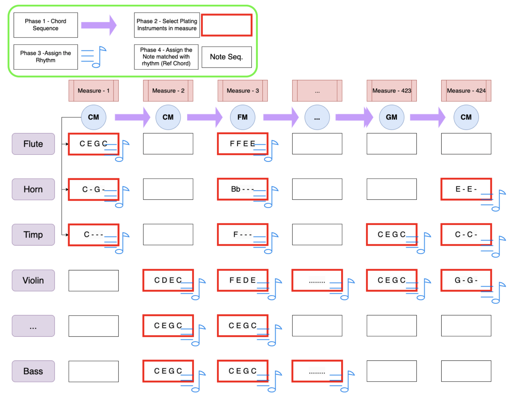

-------------------------------------------------------

## Chord Generation

Symbolic Music 에서 Midi File에 직접적으로 사용되는 Token의 종류는 {트랙, 악기 종류, 음, 박자} 4종류이다.

하지만 곡을 구성하는 것에 있어서 가장 중요한 요소는 **화음의 진행**, 따라서 Chord Generation 을 첫번째 Phase로 결정하였다.

Baseline으로 삼은 Symphony Gen 과 비교했을때 __Generation Length, Musical Information, Distribution, Efficiency__ 측면에서 더 좋은 성능을 보였다.

---------------------------------------------

#### Generation Length

같은 Dataset 을 사용했음에도 Baseline 의 경우 생성된 길이가 한정되어있는 반면, 제안한 모델은 Target과 유사한 분포를 보임. 아래는 Test Set에 대해 5마디를 Prompt로 입력하고 곡을 생성한 경우의 길이를 나타낸 그래프이다.

가로축은 생성된 음악의 마디 수, 세로 축은 해당 마디수로 생성된 곡의 수 이다.

<!-- 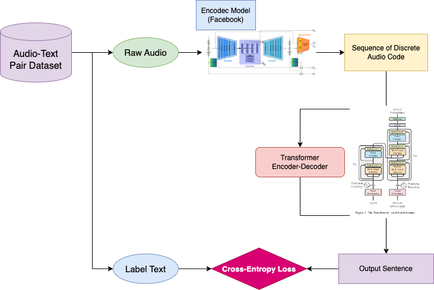 -->

<figure align="center">
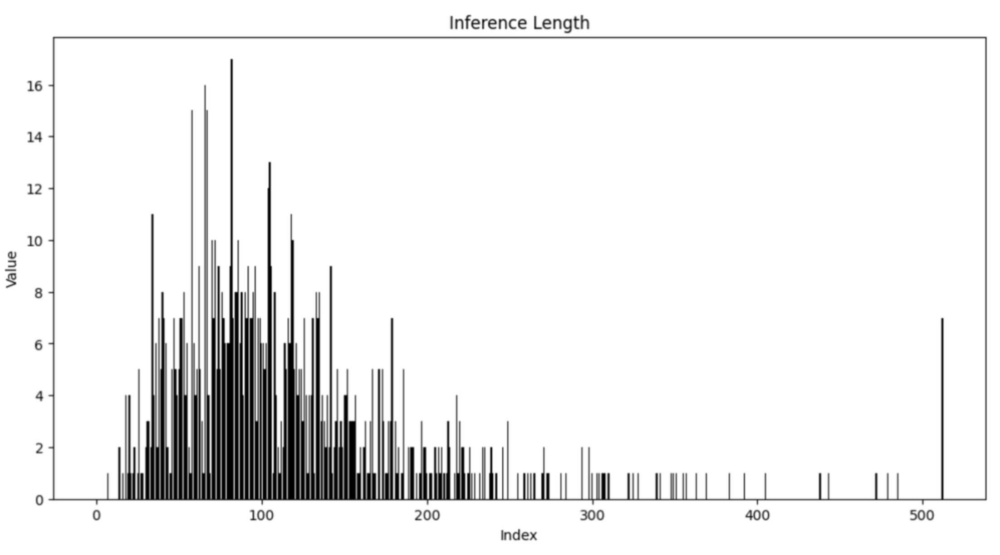
<figcaption>그림 1: 제안한 Transformer Chord Generation Model을 활용한 생성. Length의 분포가 Test Set과 비슷함을 볼 수 있고 긴 길이의 곡도 충분히 생성 가능함을 볼 수 있다.</figcaption>
</figure>

<figure align="center">
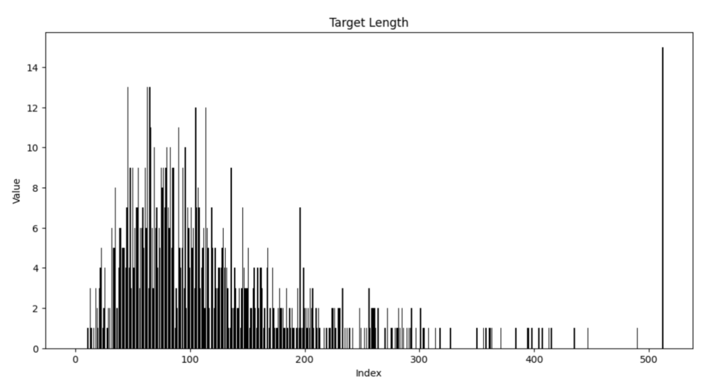
<figcaption>그림 2: Chord Generation에 사용된 Test set에 속한 곡의 길이 분포이다.</figcaption>
</figure>

<figure align="center">
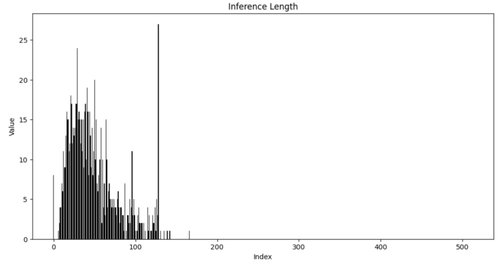
<figcaption>그림 3: Baseline을 활용한 생성. Length의 분포가 짧고 몰려있다. 200마디 이상의 곡은 생성이 전혀 되지 않음을 볼 수 있다.</figcaption>
</figure>

-----------------------------------------

#### Transformer Can Catch Musical Information

Transformer 기반의 모델들이 많은데 현재 Struted Inform, FME, FMS 등 Explicit 하게 음악적인 요소를 모델에 추가적으로 제안하는 논문들이 존재한다. 하지만 이는 모두 “한번에" 생성하려고 했을 경우이다.

Chord Sequence를 학습 할 경우 **_추가적인 요소 없이도_** 모델이 음악적인 정보를 배우는 것을 보였다.

5도권-circle 의 인접한 코드는 비슷한 코드, 반대점에 있는 코드는 거리가 먼 코드 이다. NLP에서 유사 단어 (eq 대체 가능한 관계)는 해당 token의 embedding vector 사이의 cos similarity 값이 높음이 알려져있다.

아래 결과와 같이 추가적인 정보 없이도 모델이 코드 간의 거리를 5도권에 맞게 학습됨을 볼 수 있다.

<figure align="center">
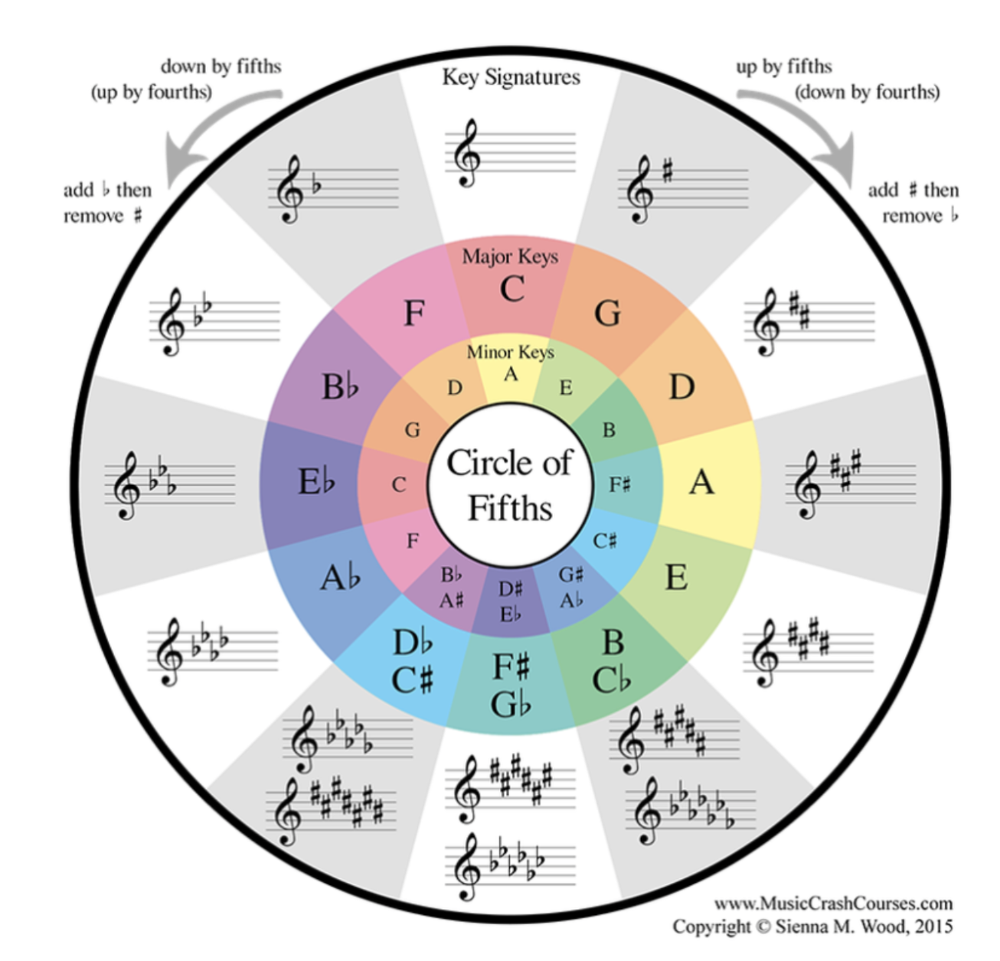
<figcaption>그림 4: 5도권 Circle. 인접한 경우 가까운 화음, 반대쪽에 있을 경우 먼 화음이다.</figcaption>
</figure>

<figure align="center">
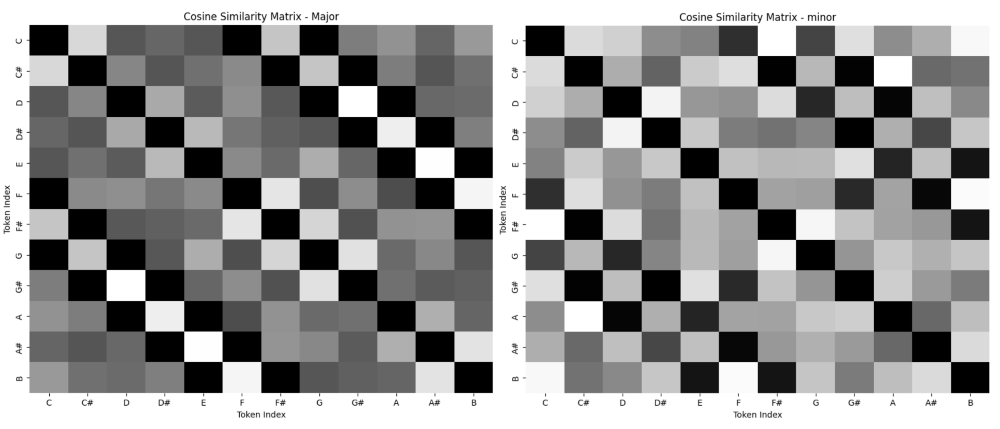
<figcaption>그림 5 : 12개의 근음에 대한 Major Chord Token(왼쪽)과 minor Chord Token(오른쪽) Embedding 사이의 Cosine Similarity를 측정한 표이다. 별도의 추가적인 Inductive Bias 없이도 모델이 음악적 의미를 학습할 수 있음을 보였다. C-Maj를 기준으로 상행 5도, 하행 5도에 있는 G-Maj, F-Maj가 가장 유사도가 높게 측정되었고, 5도권 Circle의 반대에 있는 F#-Maj 가 유사도가 낮게 나옴을 볼 수 있다. 대각선을 따라서 패턴이 보이므로 다른 음들에 대해서도 같은 경향이 있음을 알 수 있다.</figcaption>
</figure>

<figure align="center">
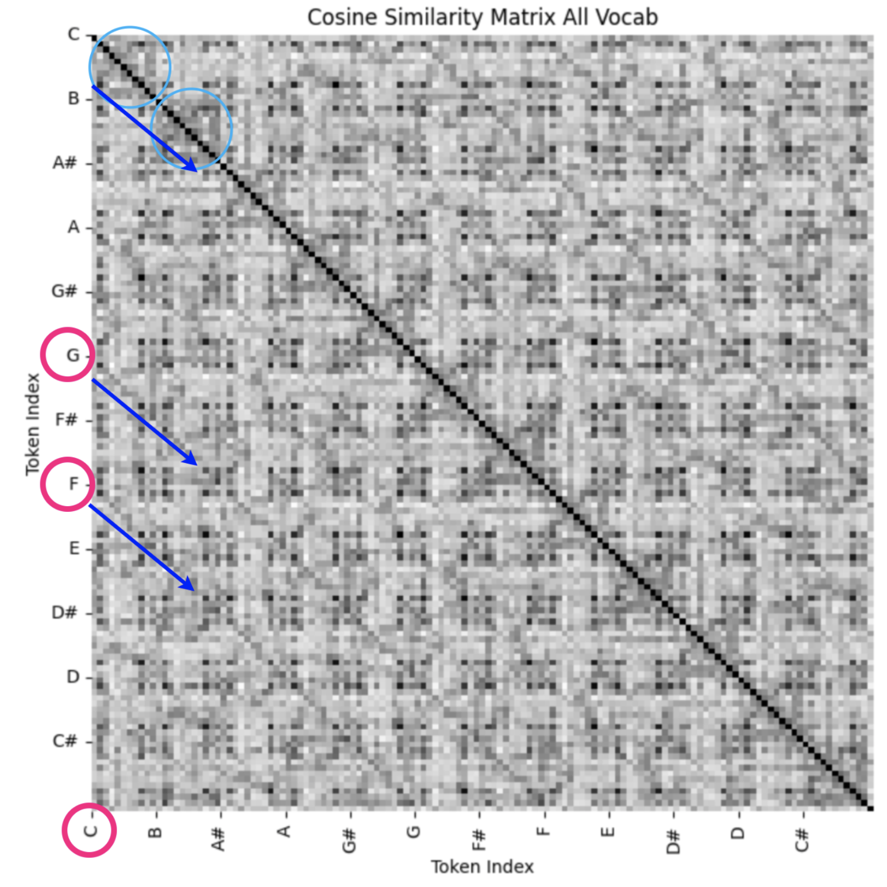
<figcaption>그림 6: 모든 Token에 대한 Cosine Similarity Matrix 이다. Chord Token은 근음 한개당 11종류의 코드 (D+, D/o7, DD7, DM, DM7, Dm, Dm7, D0, Do7, Dsus2, Dsus4)로 총 12*11 = 132 개로 구성되어있다. 마찬가지로 5도 관계에 있는 화음끼리 유사도가 높고 같은 근음을 가지는 화음 끼리의 유사도도 높음을 볼 수 있다.</figcaption>
</figure>

-----------------------------------------

#### Generated Chord Distribution

아래 그림과 같이 Test Set 에 대해서도 생성한 Chord의 Distribution이 Baseline 보다 더 일치하는 것을 보였다.

<figure align="center">
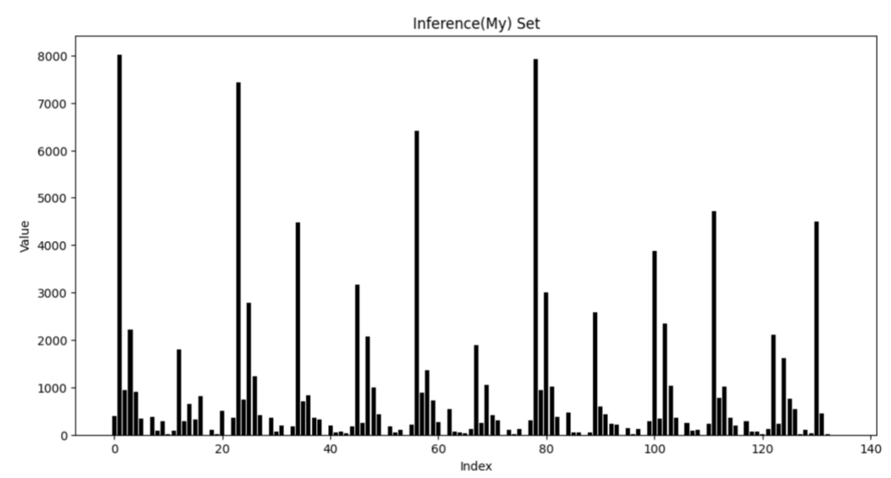
<figcaption>그림 7: 제안한 Transformer Chord Generation Model을 활용한 생성된 Chord의 분포이다. 아래 Target의 분포와 비교해 보았을때  Base Line이 생성한 분포보다 더 비슷함을 볼 수 있다.</figcaption>
</figure>

<figure align="center">
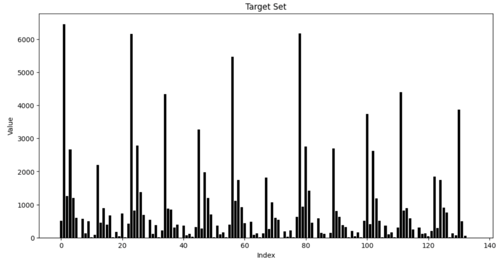
<figcaption>그림 8: Chord Generation에 사용된 Test set에 속한 곡의 길이 분포이다.</figcaption>
</figure>

<figure align="center">
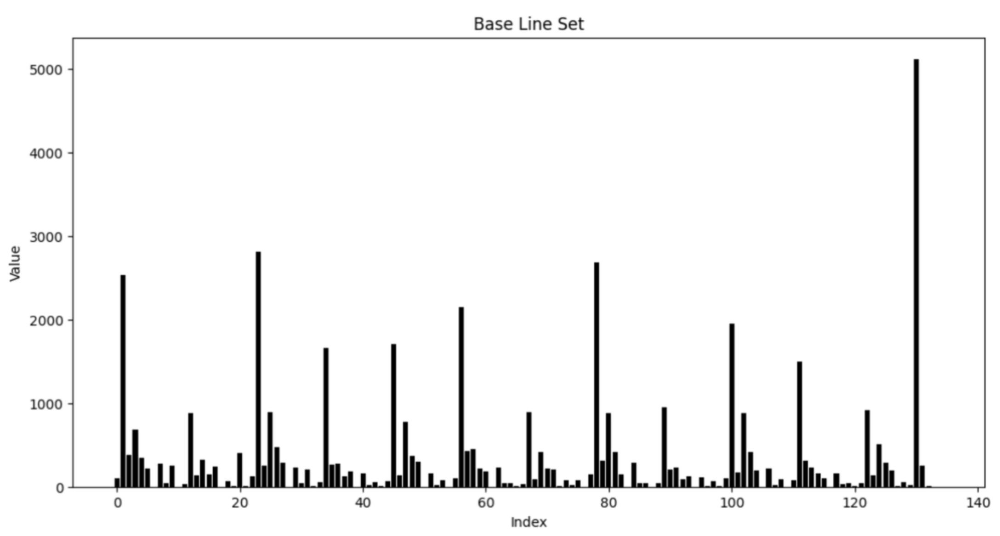
<figcaption>그림 9: Baseline을 활용한 생성. Chord의 분포가 고른 편이지만 일정 부분은 Target Set과 약간의 차이가 존재한다.</figcaption>
</figure>

-----------------------------------------

#### Efficiency - Chord BPE

클래식 음악은 길이가 길어질 경우 약 700마디 까지 늘어나기도 한다. 또한 코드는 단일 순서보다는 “진행"의 관점에서 한 Phrase 가 더 의미를 가지고 있다고 생각했다.

따라서 의미있는 Corpus를 추출하기 위해 NLP에서 사용되는 Byte Pair Encoding을 Dataset에 적용시켜 **길이를 줄임에도 불구하고 성능이 비슷**한 것을 볼 수 있고

이를 활용해 Long Sequence Data를 압축 가능하다.

<figure align="center">
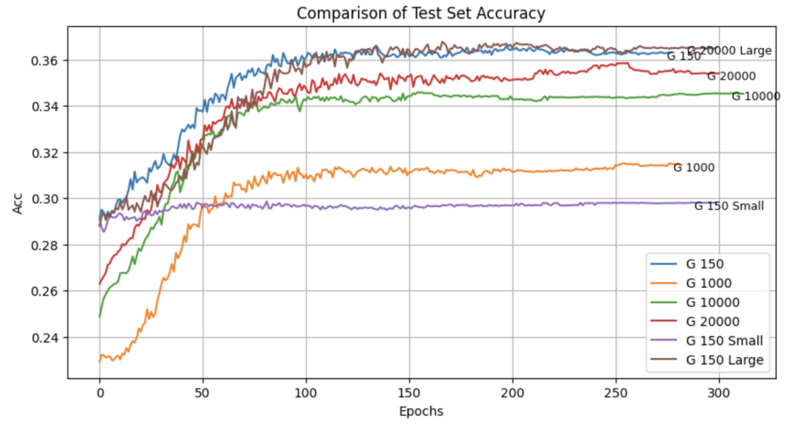
<figcaption>그림 10: Test Set에 대한 각 모델별 Chord Predict Accuracy 이다. BPE 를 사용해 Vocab Size를 150 에서 20000으로 늘릴 경우 동일한 모델 사이즈일 경우 정확도가 떨어지지만 크기를 늘릴 경우 150 case와 비슷해짐을 볼 수 있다.</figcaption>
</figure>

<figure align="center">
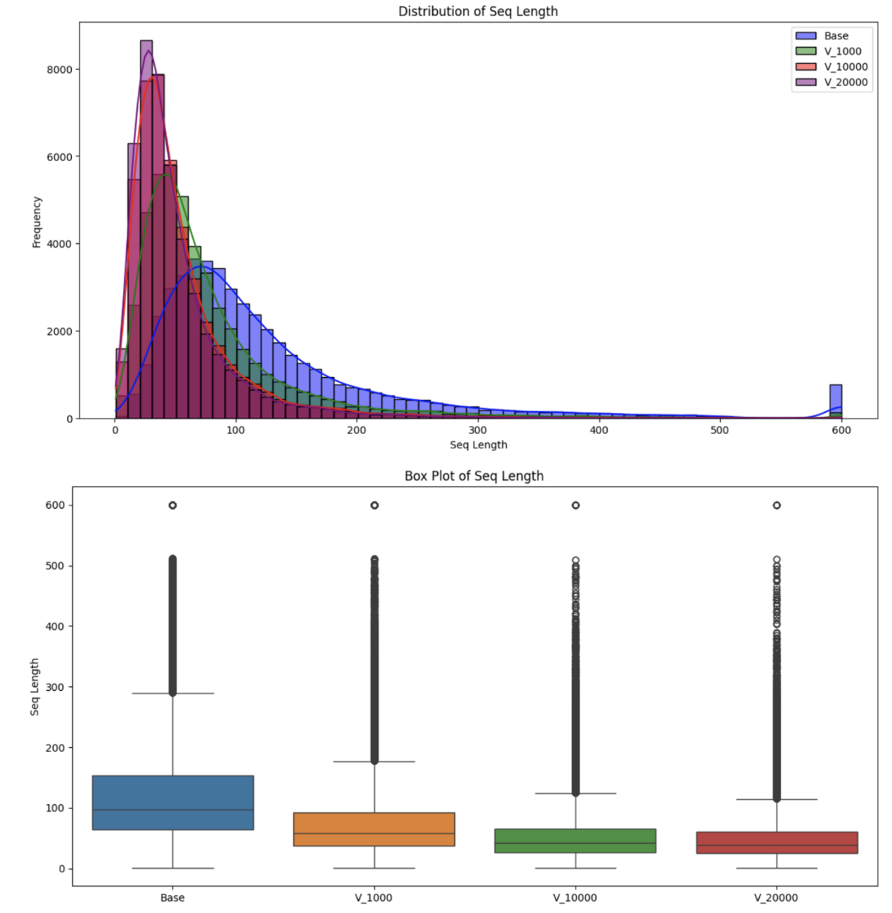
<figcaption>그림 11: BPE를 활용한 Vocab Size 수에 따른 Dataset Sequence Length 그래프이다. Vocab 수가 많아 질 수록 약 60-80 정도로 압축이 됨을 볼 수 있다.</figcaption>
</figure>

-----------------------------------------

#### Future Work

#### Instrument Candidate Phase

코드 진행(마디 수)이 정해진 뒤, 각 마디에서 연주될 악기를 정하는 단계. 참여 악기의 종류를 결정하는 요소는

1. 코드의 변화
2. 현재 곡 안에서의 위치
3. 직전에 연주된 악기의 종류.

이때 현재 곡안에서의 위치가 중요하다고 생각하였다.

곡의 길이와 상관없이 A-B-A, Sonata, Rondo, Canon같은 형식은 전체 길이에서 일정 비율로 반복하는 패턴을 띄기 때문이다.

따라서 “2. 현재 곡 안에서의 위치" 를 모델에게 알려주기 위해 전체 길이를 비율로 나눈 뒤, Quantize 하여 Positional Encoding을 하는 것을 제안.

현재 QPE 를 적용한 것과, 적용하지 않는 모델의 실험이 진행중이다.

-----------------------------------------

#### Next Research Plan

##### Instrument Candidate Phase

> Fit Structure 찾기 

> Instrument Embedding Relation 분석

##### Rhythm Phase

> Fit Structure 찾기

> Onset Position와 Duration Efficient Tokenizing

##### Note Assign Phase

> Fit Structure 찾기

> Chord 기반으로 생성된 리듬에 Note 부여

##### Downstream Task Evaluation

> 다양한 지표를 실험/제안 하여 Baseline 및 다른 모델과 비교 예정

> Composer Classification, Plagiarism Check 와 같은 Downstream Task에 대한 비교 예정

##### Writing

> 1월 IJCAI (International Joint Conferences on Artificial Intelligence) 의 AI, Art & Creative Track 에 Submit 목표
