#### Project Description

Period: **Undergraduate / Research Intern** (Mar. 2024 - Jun. 2024)

This research aims to design a model for Multi-Track Symbolic Music Generation.

The generation process is organized hierarchically, and this project focuses on the first stage: Chord Generation.

Github Model Code : [https://github.com/ongdyub/ChordGeneration/blob/main/src/model/transformer.py](https://github.com/ongdyub/ChordGeneration/blob/main/src/model/transformer.py){:target="_blank"}

-----------------------------------------------------

## Problem Definition

In the current Multi-Track Symbolic Music Generation field, most work treats 4 to 8 tracks as the main task. For cases with 12 or more tracks, "SymphonyGen," published at ISMIR 2022, is known as the current SOTA model.

However, that model generates many symbolic tokens by flattening them with a Linear Transformer. I judged that this approach does not sufficiently reflect the properties and structural characteristics of music, so I aimed to design a **_domain-specific model that incorporates musical knowledge_**.

-----------------------------------------------------

## Proposed Structure

Considering the way music is composed and the form of completed pieces, music can be viewed as being organized in phrase units. Therefore, rather than generating measure-level tokens in a flattened sequence with a Linear Transformer, I considered it more reasonable to **generate the broad structure first through a hierarchy**.

Another goal of this research is to find **model structures that fit the musical elements in each generation stage**, rather than using one Transformer to generate everything at once.

The overall generation phase was designed as shown below.

> **Step 1 : Chord Generation**

> Generate the main chord for one measure.

> **Step 2 : Instrument Select**

> Select the instruments to be played in the measure.

> **Step 3 : Rhythm Generation**

> Generate the rhythm that each instrument will play in the measure.

> **Step 4 : Note Assign**

> Assign notes related to the chord to the generated rhythm.

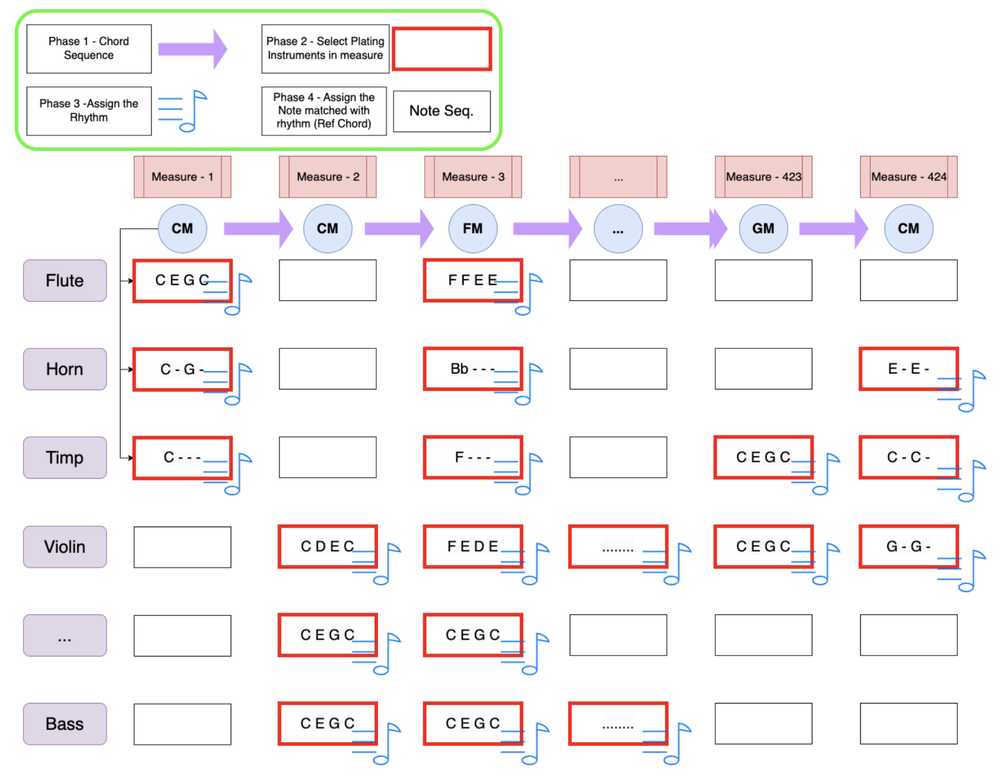

-------------------------------------------------------

## Chord Generation

In symbolic music, the token types used directly in a MIDI file are {track, instrument type, note, beat}.

However, the most important element in constructing a piece is **chord progression**, so I selected Chord Generation as the first phase.

Compared with SymphonyGen, which was used as the baseline, the proposed model performed better in terms of __generation length, musical information, distribution, and efficiency__.

---------------------------------------------

#### Generation Length

Even with the same dataset, the baseline generated outputs with limited lengths, while the proposed model showed a distribution similar to the target. The graph below shows the lengths of generated pieces when five measures from the test set were used as prompts.

The x-axis represents the number of generated measures, and the y-axis represents the number of generated pieces with that measure count.

<!--  -->

<figure align="center">
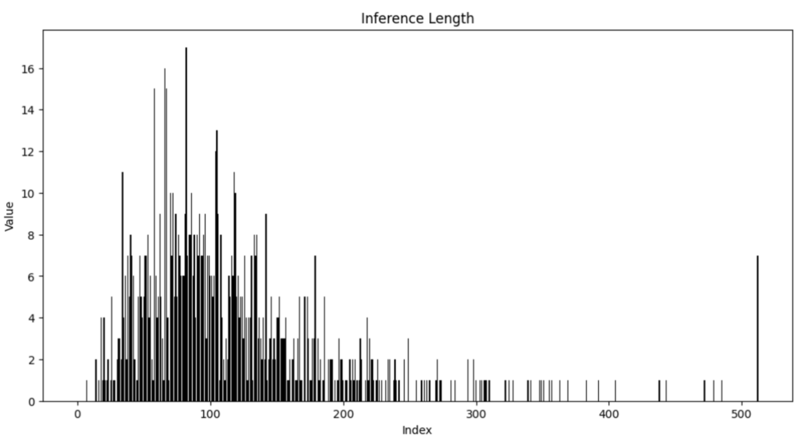
<figcaption>Figure 1: Generation using the proposed Transformer Chord Generation Model. The length distribution is similar to the test set, and the model can generate sufficiently long pieces.</figcaption>
</figure>

<figure align="center">
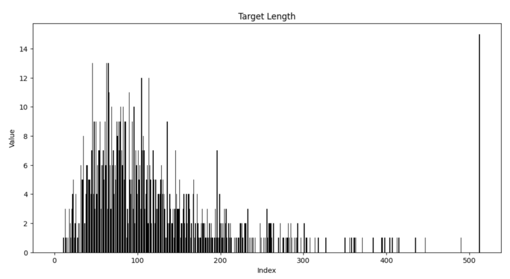
<figcaption>Figure 2: Length distribution of pieces in the test set used for Chord Generation.</figcaption>
</figure>

<figure align="center">
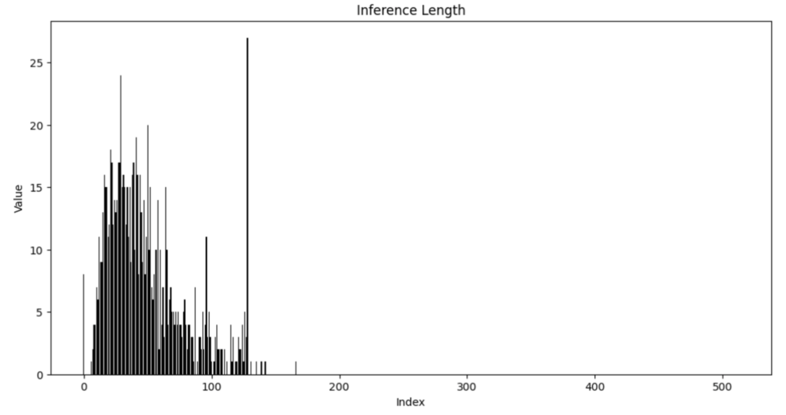
<figcaption>Figure 3: Generation using the baseline. The length distribution is short and concentrated, and no pieces longer than 200 measures are generated.</figcaption>
</figure>

-----------------------------------------

#### Transformer Can Catch Musical Information

There are many Transformer-based models, and papers such as Structured Inform, FME, and FMS explicitly add musical elements to the model. However, these approaches are all designed for generating everything "at once."

When learning only chord sequences, I showed that the model can learn musical information **_without additional elements_**.

In the circle of fifths, adjacent chords are similar chords, while chords on opposite sides are distant. In NLP, similar words, such as substitutable words, are known to have high cosine similarity between their token embedding vectors.

As shown in the results below, the model learned distances between chords according to the circle of fifths without additional information.

<figure align="center">
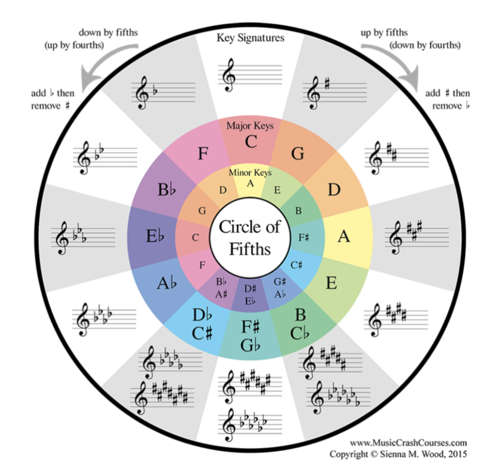
<figcaption>Figure 4: Circle of fifths. Adjacent chords are close harmonies, while opposite chords are distant harmonies.</figcaption>
</figure>

<figure align="center">
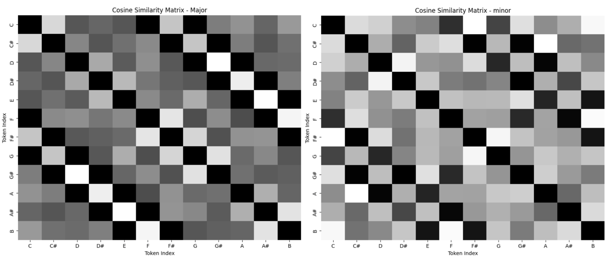
<figcaption>Figure 5: Cosine similarity tables between embeddings of Major Chord Tokens (left) and minor Chord Tokens (right) for 12 roots. The results show that the model can learn musical meaning without additional inductive bias. For C-Maj, G-Maj and F-Maj, which are an ascending fifth and descending fifth away, had the highest similarity, while F#-Maj, which is opposite on the circle of fifths, had low similarity. The diagonal pattern shows that the same tendency appears for other notes as well.</figcaption>
</figure>

<figure align="center">
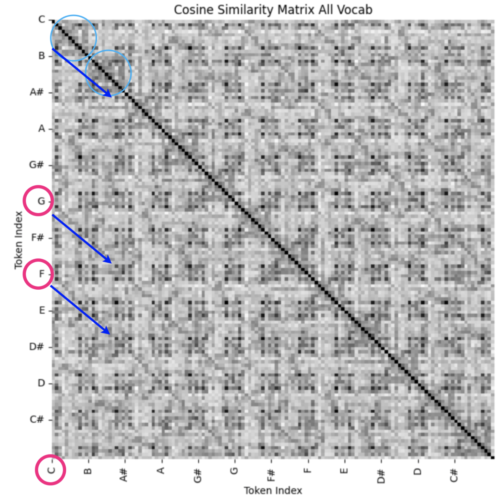
<figcaption>Figure 6: Cosine similarity matrix for all tokens. Chord tokens consist of 11 chord types per root (D+, D/o7, DD7, DM, DM7, Dm, Dm7, D0, Do7, Dsus2, Dsus4), for a total of 12*11 = 132 tokens. Similarly, chords related by fifths have high similarity, and chords with the same root also have high similarity.</figcaption>
</figure>

-----------------------------------------

#### Generated Chord Distribution

As shown below, the generated chord distribution matched the test set better than the baseline.

<figure align="center">
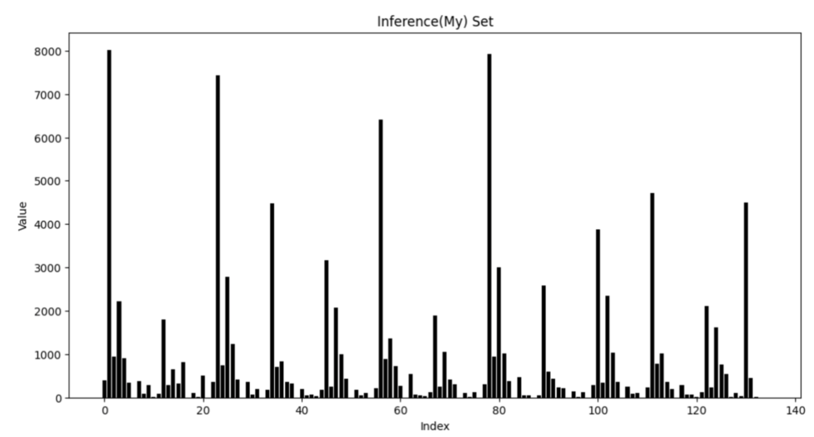
<figcaption>Figure 7: Distribution of chords generated using the proposed Transformer Chord Generation Model. Compared with the target distribution below, it is more similar than the distribution generated by the baseline.</figcaption>
</figure>

<figure align="center">
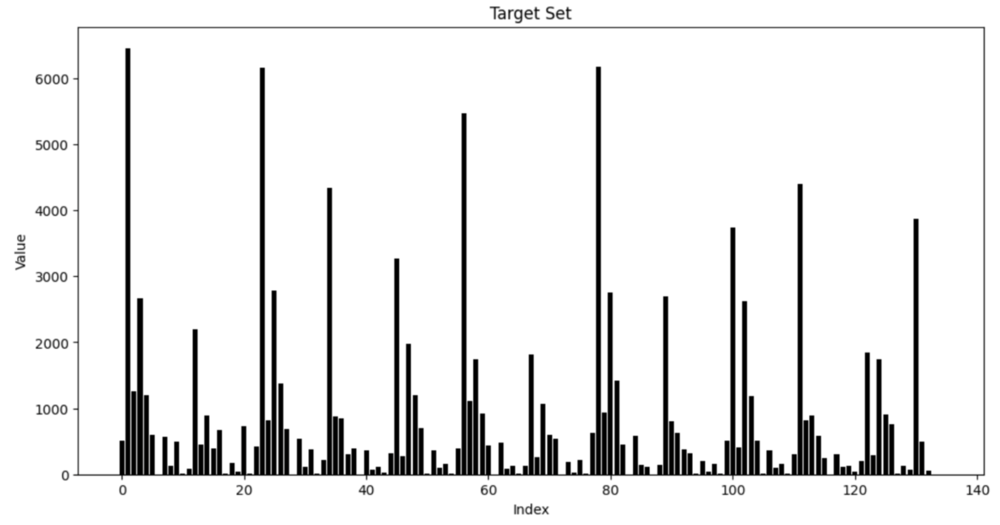
<figcaption>Figure 8: Length distribution of pieces in the test set used for Chord Generation.</figcaption>
</figure>

<figure align="center">
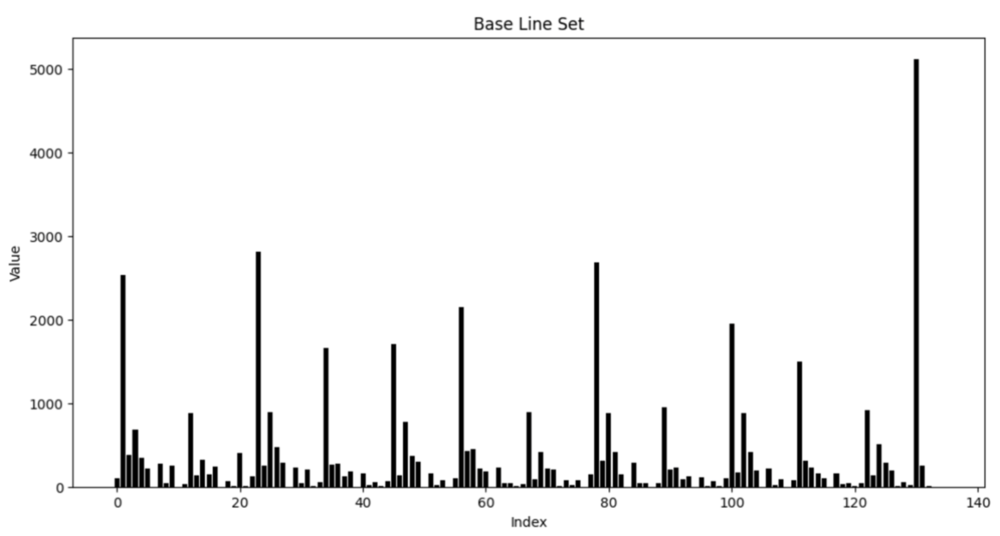
<figcaption>Figure 9: Generation using the baseline. The chord distribution is relatively even, but some parts differ from the target set.</figcaption>
</figure>

-----------------------------------------

#### Efficiency - Chord BPE

Classical music can extend to about 700 measures when the piece is long. I also thought that chords carry more meaning as progressions within a phrase than as isolated sequential units.

Therefore, to extract a meaningful corpus, I applied Byte Pair Encoding, commonly used in NLP, to the dataset and showed that **performance remained similar even while the sequence length was reduced**.

This makes it possible to compress long sequence data.

<figure align="center">
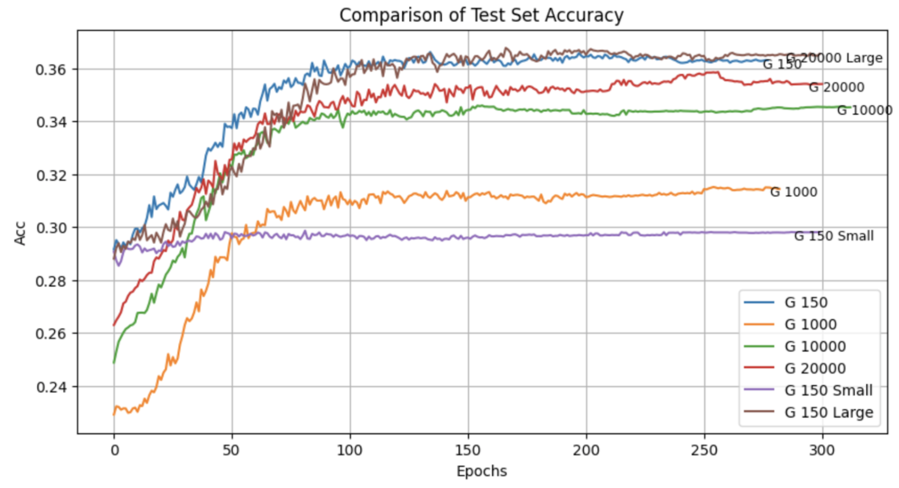
<figcaption>Figure 10: Chord prediction accuracy for each model on the test set. When BPE increases the vocabulary size from 150 to 20,000, accuracy decreases for the same model size, but becomes similar to the 150-vocabulary case when the model size is increased.</figcaption>
</figure>

<figure align="center">
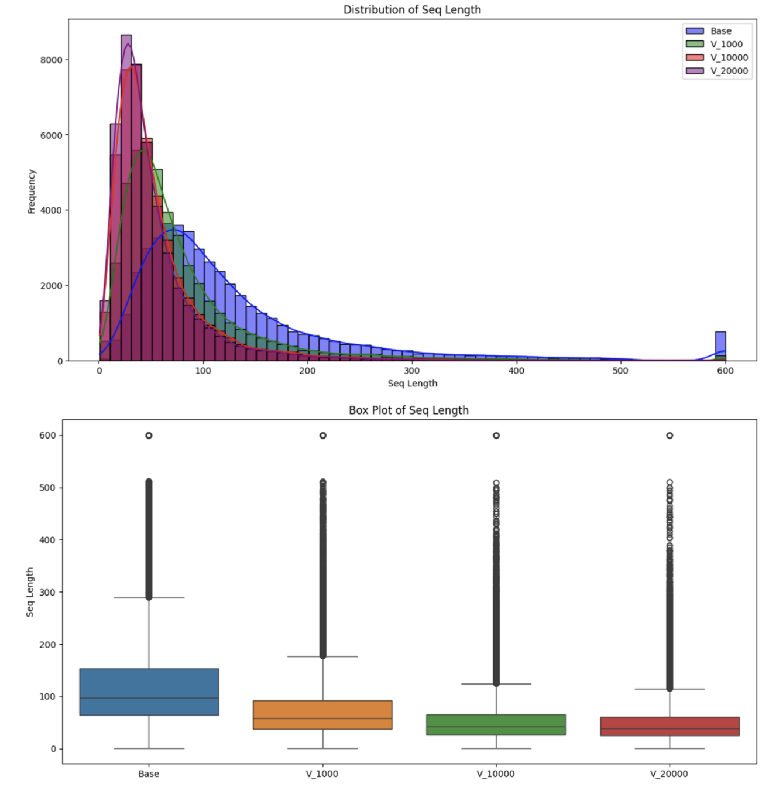
<figcaption>Figure 11: Dataset sequence length by BPE vocabulary size. As the vocabulary size increases, the sequence is compressed to about 60 to 80 tokens.</figcaption>
</figure>

-----------------------------------------

#### Future Work

#### Instrument Candidate Phase

After the chord progression, or number of measures, is determined, this stage selects the instruments that will be played in each measure. The factors determining the participating instrument types are:

1. Chord changes
2. Position within the current piece
3. Type of instrument played immediately before

I considered the position within the current piece to be important.

This is because forms such as A-B-A, Sonata, Rondo, and Canon show patterns that repeat at certain proportions of the full length, regardless of the absolute length of the piece.

Therefore, to inform the model of "2. Position within the current piece," I proposed dividing the full length by ratio and quantizing it for positional encoding.

Experiments comparing models with and without QPE are currently in progress.

-----------------------------------------

#### Next Research Plan

##### Instrument Candidate Phase

> Find a fitting structure

> Analyze instrument embedding relations

##### Rhythm Phase

> Find a fitting structure

> Efficient tokenization of onset position and duration

##### Note Assign Phase

> Find a fitting structure

> Assign notes to the chord-based generated rhythm

##### Downstream Task Evaluation

> Experiment with and propose various metrics, then compare against baselines and other models

> Compare downstream tasks such as composer classification and plagiarism checking

##### Writing

> Target submission to the AI, Art & Creative Track of IJCAI (International Joint Conference on Artificial Intelligence) in January
